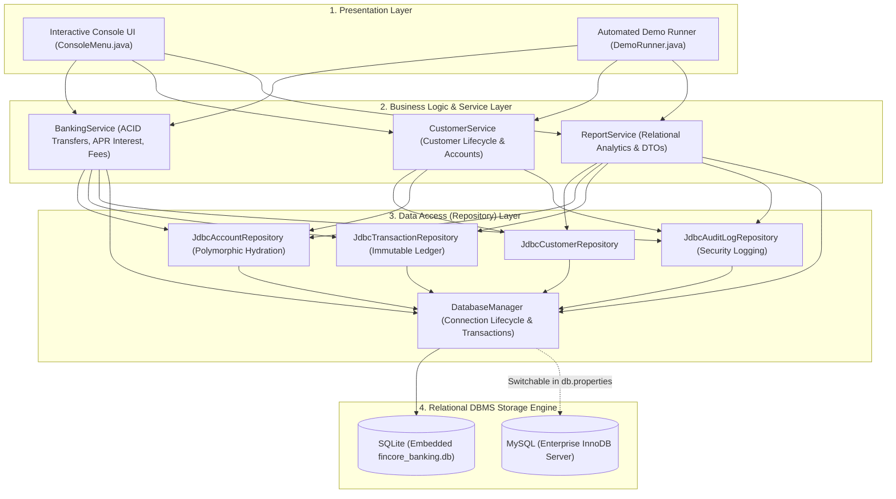
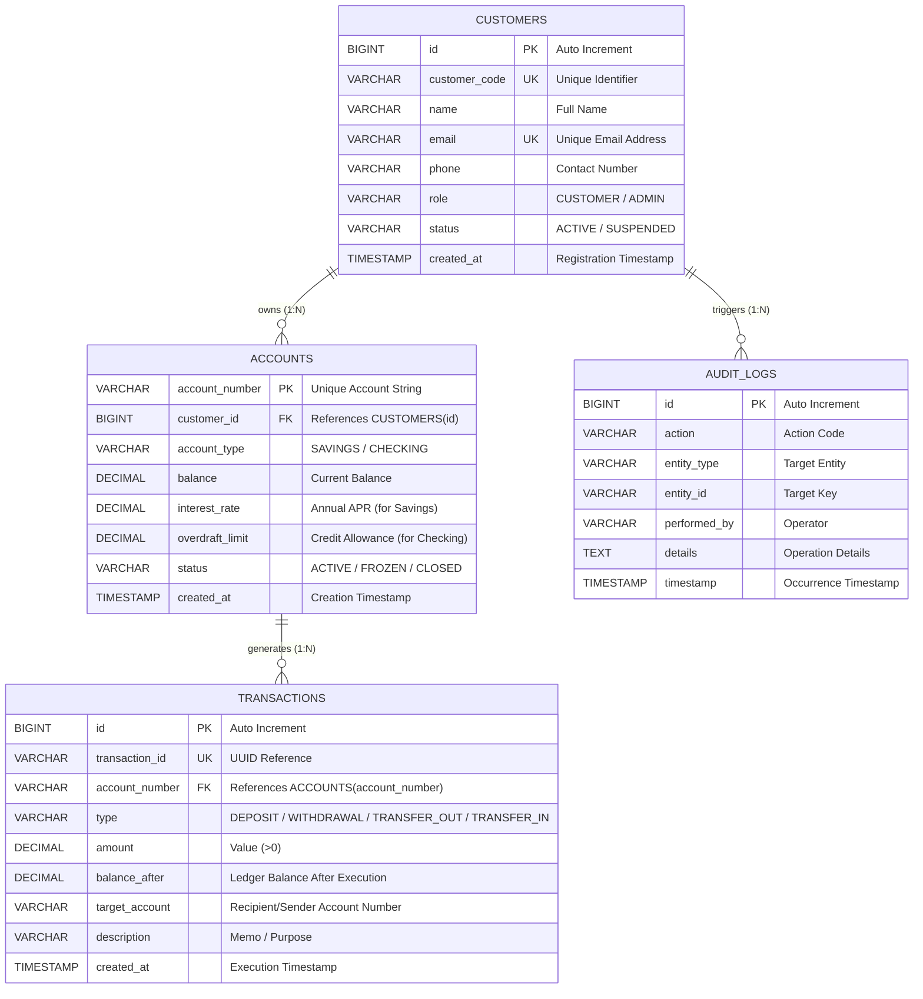

# FinCore - OOP & DBMS Capstone Banking System

An enterprise-grade Java and Relational Database Management System (DBMS) Capstone Project designed to showcase **Object-Oriented Programming (OOP)** paradigms alongside **Database Management System (DBMS)** principles, ACID transactions, and relational data analytics.

---

## 🏛️ Architectural Overview

FinCore models a modern banking system with an interactive CLI, polymorphic account logic, relational schema migrations, immutable transaction ledgers, and audit logging.



---

## 📊 Database Entity-Relationship (ER) Diagram



> 📖 **Full System Diagrams**: Detailed UML Class Diagram, Sequence Diagram, and Schema Data Dictionary are available in [`docs/ERD_AND_UML.md`](docs/ERD_AND_UML.md).

---

## 💎 1. Object-Oriented Programming (OOP) Principles

| OOP Pillar | Implementation in FinCore |
|---|---|
| **Encapsulation** | Private attributes, robust validation, domain invariants in [`Account`](src/main/java/com/fincore/model/Account.java), [`Customer`](src/main/java/com/fincore/model/Customer.java), and [`Transaction`](src/main/java/com/fincore/model/Transaction.java). Immutability of ledger records. |
| **Inheritance** | [`User`](src/main/java/com/fincore/model/User.java) is extended by [`Customer`](src/main/java/com/fincore/model/Customer.java) and [`Admin`](src/main/java/com/fincore/model/Admin.java). [`Account`](src/main/java/com/fincore/model/Account.java) is extended by [`SavingsAccount`](src/main/java/com/fincore/model/SavingsAccount.java) and [`CheckingAccount`](src/main/java/com/fincore/model/CheckingAccount.java). |
| **Polymorphism** | Overridden methods: `canWithdraw(amount)` behaves differently for Savings (minimum balance rule) vs Checking (overdraft limit). `calculateMonthlyInterestOrFee()` generates positive interest for Savings and debit fee for Checking. Hydrated polymorphically by JDBC repository. |
| **Abstraction** | Interfaces define strict contracts: [`CrudRepository<T, ID>`](src/main/java/com/fincore/repository/CrudRepository.java), [`AccountRepository`](src/main/java/com/fincore/repository/AccountRepository.java), [`CustomerRepository`](src/main/java/com/fincore/repository/CustomerRepository.java), separating business logic from database storage. |

---

## 🗄️ 2. Database Management System (DBMS) Principles

1. **Relational Schema & Integrity Constraints**:
   - Primary Keys (`account_number`, `id`)
   - Foreign Keys with cascade rules (`accounts.customer_id -> customers.id`, `transactions.account_number -> accounts.account_number`)
   - `CHECK` constraints (e.g., `amount > 0`, `balance >= -10000.0`, valid status enums)
   - `UNIQUE` constraints (emails, customer codes, transaction UUIDs)
2. **ACID Transactions (Atomicity & Consistency)**:
   - Money transfers in [`BankingService.java`](src/main/java/com/fincore/service/BankingService.java) use `conn.setAutoCommit(false)`, updating both balances and recording dual ledger records atomically.
   - If any validation or network failure occurs, `conn.rollback()` restores the initial state completely with zero fund loss.
3. **SQL Injection Protection**:
   - 100% of queries use parameterized `PreparedStatement`.
4. **Relational Analytics (JOINs & Aggregations)**:
   - Multi-table `LEFT JOIN` with `COUNT(DISTINCT ...)`, `COALESCE(SUM(...))`, `GROUP BY` and `ORDER BY` to compute customer portfolios and bank liquidity.
5. **Database Portability**:
   - Out-of-the-box zero configuration with embedded SQLite (`fincore_banking.db`).
   - Switchable to MySQL server via `src/main/resources/db.properties`.

---

## 🚀 Quick Start

### 1. Build and Run Automated Tests
```bash
cd /home/ubuntu/oop-dbms-capstone
./run.sh --test
# or
mvn test
```

### 2. Run Automated Live Demonstration
Showcases OOP polymorphism, CRUD operations, ACID commit, ACID rollback, and SQL analytics without manual input:
```bash
./run.sh --demo
# or
mvn exec:java -Dexec.args="--demo"
```

### 3. Launch Interactive Console UI
```bash
./run.sh
# or
mvn exec:java
```

---

## ⚙️ Configuration (SQLite vs MySQL)

Edit `src/main/resources/db.properties`:
```properties
# To use SQLite (default, zero configuration file-based):
db.type=sqlite
sqlite.url=jdbc:sqlite:fincore_banking.db

# To use MySQL (running on localhost or remote server):
# db.type=mysql
# mysql.url=jdbc:mysql://localhost:3306/fincore_db?createDatabaseIfNotExist=true
# mysql.user=root
# mysql.password=your_password
```

---

## 📂 Project Structure

```
oop-dbms-capstone/
├── pom.xml                               # Maven project dependencies & plugins
├── run.sh                                # Execution helper script
├── README.md                             # Documentation
├── src/
│   ├── main/
│   │   ├── java/com/fincore/
│   │   │   ├── Main.java                 # Bootstrap entrypoint & DI wiring
│   │   │   ├── config/DatabaseConfig.java
│   │   │   ├── db/
│   │   │   │   ├── DatabaseManager.java  # Connection pooling & transactions
│   │   │   │   └── MigrationRunner.java  # Auto DDL schema executor
│   │   │   ├── model/                    # OOP Entities
│   │   │   │   ├── User.java             # Abstract base user
│   │   │   │   ├── Customer.java         # Extends User
│   │   │   │   ├── Admin.java            # Extends User
│   │   │   │   ├── Account.java          # Abstract base account
│   │   │   │   ├── SavingsAccount.java   # Extends Account (Polymorphic APR)
│   │   │   │   ├── CheckingAccount.java  # Extends Account (Polymorphic Overdraft)
│   │   │   │   ├── AccountType.java      # Enum
│   │   │   │   ├── Transaction.java      # Immutable ledger record
│   │   │   │   ├── TransactionType.java  # Enum
│   │   │   │   ├── AuditLog.java         # Audit log entity
│   │   │   │   └── CustomerSummaryDTO.java # Analytical JOIN DTO
│   │   │   ├── repository/               # Data Access Object Interfaces
│   │   │   │   ├── CrudRepository.java
│   │   │   │   ├── CustomerRepository.java
│   │   │   │   ├── AccountRepository.java
│   │   │   │   ├── TransactionRepository.java
│   │   │   │   ├── AuditLogRepository.java
│   │   │   │   └── impl/                 # JDBC implementations
│   │   │   ├── service/                  # Business logic & ACID transactions
│   │   │   │   ├── BankingService.java
│   │   │   │   ├── CustomerService.java
│   │   │   │   ├── ReportService.java
│   │   │   │   └── exception/
│   │   │   └── ui/                       # Presentation layer
│   │   │       ├── ConsoleColors.java
│   │   │       ├── ConsoleMenu.java      # Interactive CLI
│   │   │       └── DemoRunner.java       # Automated showcase
│   │   └── resources/
│   │       ├── db.properties             # DB configuration
│   │       ├── schema-sqlite.sql         # DDL constraints & indexes
│   │       ├── schema-mysql.sql          # MySQL DDL
│   │       └── seed.sql                  # Initial seed records
│   └── test/java/com/fincore/
│       ├── AccountPolymorphismTest.java  # OOP polymorphism tests
│       ├── BankingServiceTest.java       # ACID atomicity & rollback tests
│       └── RepositoryIntegrationTest.java# DBMS CRUD & JOIN tests
```
