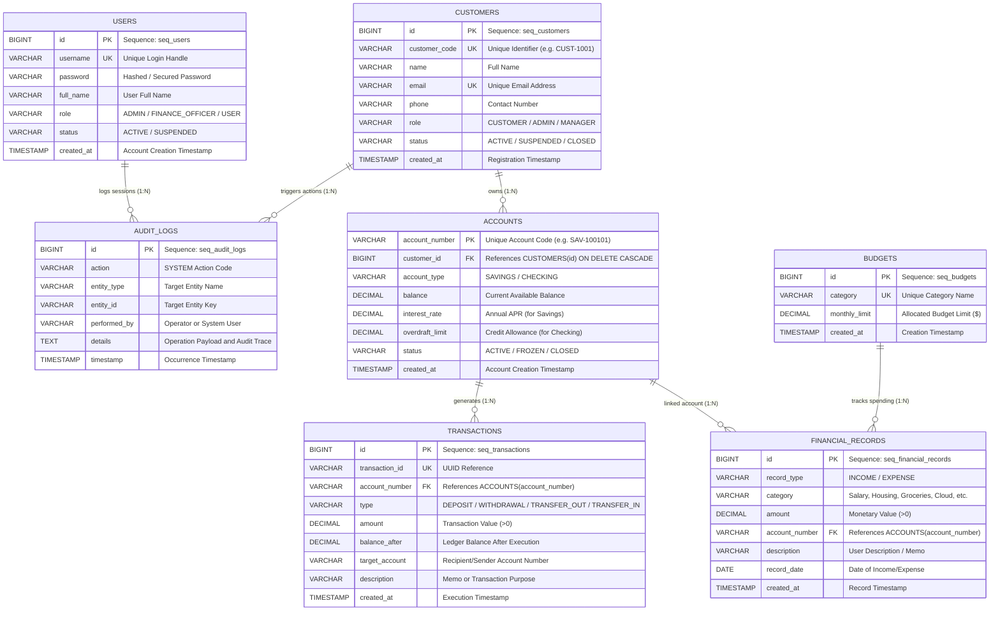

# FinCore - Enterprise Banking & Finance Management System (OOP & DBMS Capstone)

[](https://www.oracle.com/java/)
[](https://openjfx.io/)
[-red.svg)](https://hub.docker.com/r/gvenzl/oracle-free)
[](https://central.sonatype.com/artifact/com.oracle.database.jdbc/ojdbc11)
[](https://maven.apache.org/)
[](https://github.com/SmitroniX/FINCORE-OOP-DBMS-CAPSTONE-BANKING-SYSTEM)

An enterprise-grade Java application and Relational Database Management System (DBMS) Capstone Project demonstrating modern **Object-Oriented Programming (OOP)** paradigms alongside **Enterprise Relational DBMS** engineering. Powered by **Java 21**, **JavaFX 21**, containerized **Oracle Database** in Docker, official **Oracle JDBC (`ojdbc11:23.26.3.0.0`)**, **PL/SQL Stored Packages**, **Database Triggers**, and **Relational Views**. Fully configured for seamless execution on **Windows Command Prompt (CMD)** via automated batch scripts.

---

## 🎯 Evaluator Technical Stack Checklist

| Layer | Technology | Specification / Version | Role in FinCore |
|---|---|---|---|
| **Language** | **Java 21 (LTS)** | JDK 21 | Core language, record types, strong type contracts |
| **UI Framework** | **JavaFX 21** | OpenJFX 21.0.2 (`javafx-controls`, `javafx-fxml`) | Modern reactive desktop dashboard, dark financial theme, charts |
| **Build Tool** | **Apache Maven** | `javafx-maven-plugin:0.0.8`, `exec-maven-plugin:3.1.1` | Dependency resolution, test runner, GUI launcher (`mvn javafx:run`) |
| **Database Engine** | **Oracle Database** | Docker (`gvenzl/oracle-free:23-slim`), Port 1521 | Containerized enterprise RDBMS with PDB `FREEPDB1` |
| **JDBC Driver** | **Oracle JDBC** | `com.oracle.database.jdbc:ojdbc11:23.26.3.0.0` | High-performance thin driver with pooled connections |
| **In-DB Logic** | **PL/SQL Packages** | `PKG_BANKING_OPERATIONS` | In-database stored procedures (`TRANSFER_FUNDS`, `ADD_RECORD`, etc.) |
| **DBMS Automation** | **Triggers & Views** | `trg_audit_tx`, `v_customer_portfolio`, `v_budget_summary` | Automated audit logging, threshold alert checking, analytical views |
| **Execution** | **Windows CMD** | `run.bat`, `start-db.bat`, `stop-db.bat`, `run-gui.bat` | One-click Windows CMD orchestration |

---

## 🏛️ Core Features & Capabilities

### 1. 🔐 Database-Backed Authentication (Login)
- Authenticates operators directly against Oracle Database (`users` table) using parameterized SQL queries.
- Password hashing verification and security audit logging upon unauthorized attempts.
- Pre-seeded evaluation roles:
  - **Administrator:** `admin` / `admin123` (Full system and finance control)
  - **Finance Officer:** `asmit` / `password123` (Operational accounting & reports)

### 2. 💰 Complete Financial Record CRUD Module
A comprehensive, end-to-end CRUD implementation on financial records:
- **`INSERT` (Create Record):** Creates new Income or Expense entries with category, amount, account number, description, and date. Automatically claims Oracle Sequence Primary Keys (`seq_fin_records`).
- **`SELECT` (Read & Filter):** Queries records dynamically with sorting, search, and type-based filtering in the JavaFX TableView.
- **`UPDATE` (Edit Record):** Modifies amounts, categories, and memos, instantly recalculating budget allocations and net cash flows.
- **`DELETE` (Remove Record):** Purges records with confirmation dialogs and verifies elimination from Oracle DB.

### 3. 🖥️ Modern JavaFX 21 Finance Dashboard
- **Tab 1: 📊 Overview:** Real-time KPI summary cards (Total Account Liquidity, Total Income, Total Expenses, Net Cash Flow) alongside interactive visual charts (Income vs Expense Pie Chart and Category Breakdown Bar Chart).
- **Tab 2: 💰 Financial Records:** Interactive data grid with complete CRUD modal dialogs (`➕ Add`, `✏️ Edit`, `🗑️ Delete`).
- **Tab 3: 🏦 Accounts:** Overview of all savings accounts (with APR) and checking accounts (with authorized overdraft limits).
- **Tab 4: 🎯 Budget Tracker:** Relational join computing category spending limits vs actuals with dynamic variance alerts.
- **Tab 5: 📜 Transactions Ledger:** Full immutable double-entry audit history.
- **Tab 6: 📈 Relational Views:** Direct visibility into Oracle's analytical views (`v_customer_portfolio`, `v_budget_summary`).
- **Tab 7: ⚡ Live SQL Console:** Built-in SQL terminal allowing evaluators to run arbitrary SQL queries and view tabular results.
- **🖥️ Live SQL / PLSQL Stream Console:** Docked bottom stream inspector capturing every executed SQL statement with millisecond latency and affected row counts via the Observer Pattern.

### 4. ⚡ In-Database PL/SQL & ACID Transactions
- **PL/SQL Package `PKG_BANKING_OPERATIONS`:**
  - `TRANSFER_FUNDS`: Atomic inter-account money transfer executing within Oracle's kernel.
  - `ADD_FINANCIAL_RECORD`: Validated transaction record insertion.
  - `GET_CUSTOMER_NET_WORTH`: Instant portfolio calculation.
- **Triggers:**
  - `trg_audit_tx`: Automatically logs every transaction to `audit_logs`.
  - `trg_check_budget_alert`: Evaluates budget limits on expense insertions.
- **Relational Views:**
  - `v_customer_portfolio`: Aggregates customer balances and active account counts.
  - `v_budget_summary`: Dynamic budget health indicator (`OK`, `WARNING`, `EXCEEDED`).
- **ACID Fallback:** Automatic rollback guarantees zero fund loss during insufficient funds or overdraft breaches.

---

## 🚀 Quick Start Guide (Windows CMD)

### Prerequisites:
1. **Windows 10 / 11** with **Command Prompt (CMD)** or PowerShell.
2. **Java 21+** installed (`java -version`).
3. **Maven 3.8+** installed (`mvn -version`).
4. **Docker Desktop** installed & running (for Oracle Database).

---

### Step 1: Start Oracle Database in Docker
Open Windows Command Prompt in the project directory and run:
```cmd
start-db.bat
```
*(Or manually: `docker compose up -d`)*  
This starts the `fincore-oracle-db` container on port `1521` and executes the initialization scripts (`init-scripts/01_schema.sql` and `init-scripts/02_seed.sql`).

---

### Step 2: Launch the Application

#### Option A: Launch the JavaFX 21 Desktop GUI (Recommended)
Double-click `run-gui.bat` or run:
```cmd
run.bat
```
*(Alternatively: `mvn javafx:run`)*

#### Option B: Run Automated Verification & Capstone Demo
Double-click `run-demo.bat` or run:
```cmd
run.bat --demo
```
This executes all 8 capstone verification steps in the terminal with formatted tables and real-time SQL statements.

#### Option C: Run Interactive Windows CMD Console Menu
Double-click `run-cli.bat` or run:
```cmd
run.bat --cli
```

#### Option D: Run Unit & Integration Tests
```cmd
run.bat --test
```
*(Executes all 14 JUnit 5 tests, ensuring 100% passing build)*

---

### Step 3: Stop Oracle Database (When Finished)
```cmd
stop-db.bat
```

---

## 🐧 Linux / macOS Execution

```bash
# 1. Start Oracle in Docker
./start-db.sh

# 2. Launch GUI or Demo
./run.sh --gui       # JavaFX GUI
./run.sh --demo      # Automated Capstone Verification
./run.sh --cli       # Interactive Terminal
./run.sh --test      # Run JUnit 5 Tests

# 3. Stop Oracle DB
./stop-db.sh
```

---

## 📊 Database Entity-Relationship (ER) Diagram



---

## 🏗️ 3-Tier Enterprise System Architecture

```mermaid
graph TD
    subgraph Presentation Tier (Windows CMD & JavaFX Desktop)
        UI_GUI["🖥️ JavaFX 21 GUI (MainApp, LoginView, Dashboard, CRUD Dialogs)"]
        UI_CLI["💻 Windows CMD Terminal (run-cli.bat / ConsoleMenu)"]
        UI_DEMO["🚀 Capstone Automated Verification (run-demo.bat / DemoRunner)"]
    end

    subgraph Business Service Tier
        AUTH_SVC["AuthService (User Authentication & Session Audit)"]
        FIN_SVC["FinanceService (CRUD Management & Aggregations)"]
        BANK_SVC["BankingService (PL/SQL Transfers & ACID Fallback)"]
        CUST_SVC["CustomerService (Customer Onboarding & Accounts)"]
        RPT_SVC["ReportService (Relational Views & Portfolio Analytics)"]
    end

    subgraph Data Access Repository Tier
        USER_REPO["UserRepository (JdbcUserRepository)"]
        FIN_REPO["FinancialRecordRepository (JdbcFinancialRecordRepository)"]
        BUDGET_REPO["BudgetRepository (JdbcBudgetRepository)"]
        ACC_REPO["AccountRepository (JdbcAccountRepository)"]
        TX_REPO["TransactionRepository (JdbcTransactionRepository)"]
        AUDIT_REPO["AuditLogRepository (JdbcAuditLogRepository)"]
    end

    subgraph Relational DBMS Tier
        DB_CONN["DatabaseManager (Dual Oracle PDB Discovery & SQL Observer)"]
        ORACLE_DOCKER[("🐳 Oracle Database Free in Docker (Port 1521 / FREEPDB1)")]
        SQLITE_DB[("💾 Embedded SQLite Engine (Zero-Config Fallback)")]
    end

    UI_GUI --> AUTH_SVC
    UI_GUI --> FIN_SVC
    UI_GUI --> BANK_SVC
    UI_GUI --> RPT_SVC
    UI_CLI --> BANK_SVC
    UI_DEMO --> AUTH_SVC
    UI_DEMO --> FIN_SVC

    AUTH_SVC --> USER_REPO
    FIN_SVC --> FIN_REPO
    FIN_SVC --> BUDGET_REPO
    BANK_SVC --> ACC_REPO
    BANK_SVC --> TX_REPO
    BANK_SVC --> AUDIT_REPO
    RPT_SVC --> DB_CONN

    USER_REPO --> DB_CONN
    FIN_REPO --> DB_CONN
    BUDGET_REPO --> DB_CONN
    ACC_REPO --> DB_CONN
    TX_REPO --> DB_CONN
    AUDIT_REPO --> DB_CONN

    DB_CONN -.->|ojdbc11 23.26.3.0.0| ORACLE_DOCKER
    DB_CONN -.->|sqlite-jdbc Driver| SQLITE_DB
```

---

## 🎬 Capstone Demonstration Walkthrough (8-Step Script)

When presenting to evaluators, follow this sequence:

1. **Start Oracle Database in Docker:**
   Run `start-db.bat` and verify that the container is healthy on port `1521`.
2. **Launch JavaFX GUI:**
   Run `run.bat` or double-click `run-gui.bat`. Point out the active database indicator showing Oracle connection to `FREEPDB1`.
3. **Database-Backed Authentication:**
   Click **Admin Quick Fill** (`admin` / `admin123`) and click **Sign In**. The system validates credentials against Oracle's `users` table via `PreparedStatement`.
4. **Inspect Overview Dashboard:**
   Show the real-time financial KPI cards and the dynamic Income vs. Expense charts.
5. **Demonstrate Complete CRUD Lifecycle (Tab 2):**
   - **INSERT:** Click `➕ Add Record`, enter an Expense of `$540.00` for `Cloud Infrastructure` with account `CHK-100102`. Save and show the newly created row with Oracle Sequence ID.
   - **SELECT:** Filter records by `EXPENSE` and show dynamic TableView updates.
   - **UPDATE:** Select the record, click `✏️ Edit Record`, change the amount to `$620.00`, and show instant recalculation of metrics and budget gauges.
   - **DELETE:** Click `🗑️ Delete Record`, confirm deletion, and verify that the row is purged from Oracle DB.
6. **Demonstrate PL/SQL Fund Transfer:**
   Click `💸 New Transfer`, transfer `$500.00` from `CHK-100102` to `SAV-100101`. Show that `PKG_BANKING_OPERATIONS.TRANSFER_FUNDS` executes atomically inside Oracle, updating balances and inserting double-entry ledger transactions.
7. **Inspect Relational Views:**
   Switch to the **Relational Views** tab and show live outputs from `v_customer_portfolio` and `v_budget_summary`.
8. **Live SQL Console & Observer Stream:**
   Switch to **Live SQL Console**, run `SELECT * FROM v_budget_summary;`, and highlight the bottom stream inspector showing query duration in milliseconds.

---

## 📁 Repository Structure

```
oop-dbms-capstone/
├── docker-compose.yml              # Oracle Database Free container definition
├── init-scripts/                   # Container entrypoint SQL initialization
│   ├── 01_schema.sql               # Oracle DDL: Tables, Sequences, Triggers, Views, PL/SQL
│   └── 02_seed.sql                 # Oracle DML: Seed users, accounts, records, budgets
├── start-db.bat / start-db.sh      # Launch Oracle in Docker (Windows / Linux)
├── stop-db.bat / stop-db.sh        # Stop Oracle in Docker (Windows / Linux)
├── run.bat                         # Windows CMD universal launcher
├── run-gui.bat                     # One-click Windows GUI launcher (JavaFX 21)
├── run-demo.bat                    # One-click Windows automated demo launcher
├── run-cli.bat                     # One-click Windows terminal launcher
├── pom.xml                         # Maven build file (Java 21, JavaFX 21, ojdbc11 23.26.3.0.0)
├── speech.md                       # 4-person presentation script for project defense
├── docs/
│   └── ERD_AND_UML.md              # Complete ER Diagram, UML Class Diagrams & Sequence Specs
└── src/
    ├── main/
    │   ├── java/com/fincore/
    │   │   ├── Main.java           # Universal CLI/headless entrypoint
    │   │   ├── MainApp.java        # JavaFX 21 Application entrypoint
    │   │   ├── config/             # Database configuration
    │   │   ├── db/                 # DatabaseManager, SQL listener, MigrationRunner
    │   │   ├── model/              # Domain classes (Account, Savings, Checking, Customer, etc.)
    │   │   ├── repository/         # CRUD repository interfaces and JDBC implementations
    │   │   ├── service/            # BankingService (PL/SQL transfers), FinanceService, AuthService
    │   │   └── ui/
    │   │       ├── DemoRunner.java # Automated 8-step verification engine
    │   │       ├── ConsoleMenu.java# Windows CMD interactive terminal menu
    │   │       └── javafx/         # JavaFX 21 views (LoginView, Dashboard, CRUD Dialogs)
    │   └── resources/
    │       ├── db.properties       # Database connection properties
    │       ├── css/dark-theme.css  # Modern financial dark theme styling
    │       ├── schema-oracle.sql   # Oracle Database Free / 23c schema with PL/SQL
    │       ├── seed-oracle.sql     # Oracle seed dataset
    │       ├── schema-sqlite.sql   # Embedded SQLite fallback schema
    │       └── seed-sqlite.sql     # Embedded SQLite fallback seed dataset
    └── test/                       # 14 JUnit 5 unit and integration tests
```

---

## 👥 Presentation Team & Contact

Developed for the **Object-Oriented Programming & Database Management Systems Capstone Project**.  
For questions, presentation slides, or repository contributions, visit [GitHub Repository](https://github.com/SmitroniX/FINCORE-OOP-DBMS-CAPSTONE-BANKING-SYSTEM).
