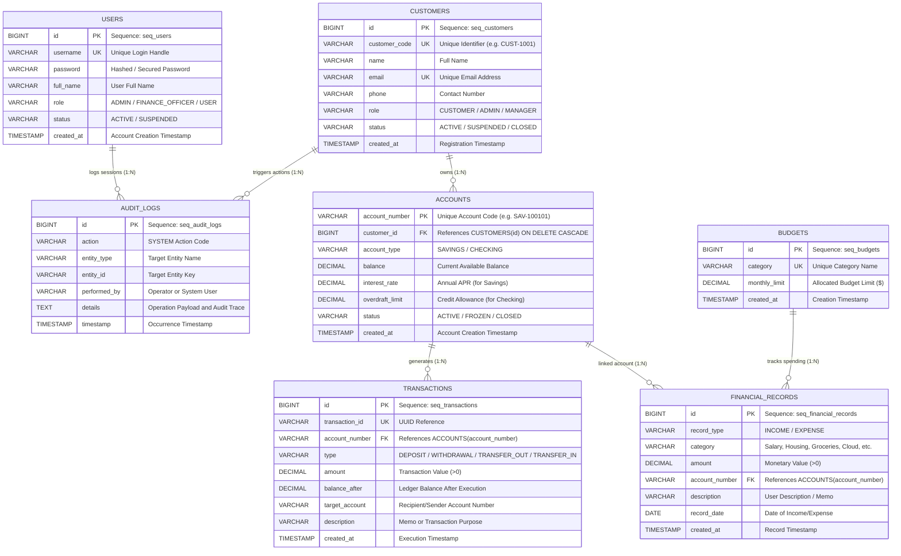

# FinCore - Enterprise Banking & Finance Management System (OOP & DBMS Capstone)

[](https://www.oracle.com/java/)
[](https://openjfx.io/)
[-red.svg)](https://hub.docker.com/r/gvenzl/oracle-free)
[](https://central.sonatype.com/artifact/com.oracle.database.jdbc/ojdbc11)
[](https://maven.apache.org/)
[](https://github.com/SmitroniX/FINCORE-OOP-DBMS-CAPSTONE-BANKING-SYSTEM)

An enterprise-grade Java application and Relational Database Management System (DBMS) Capstone Project demonstrating modern **Object-Oriented Programming (OOP)** paradigms alongside **Enterprise Relational DBMS** engineering. Powered by **Java 21**, **JavaFX 21**, containerized **Oracle Database** in Docker, official **Oracle JDBC (`ojdbc11:23.26.3.0.0`)**, **PL/SQL Stored Packages**, **Database Triggers**, and **Relational Views**.

---

## 🎯 Evaluator Technical Stack Checklist

| Layer | Technology | Specification / Version | Role in FinCore |
|---|---|---|---|
| **Language** | **Java 21 (LTS)** | JDK 21 | Core language, record types, strong type contracts |
| **UI Framework** | **JavaFX 21** | OpenJFX 21.0.2 (`javafx-controls`, `javafx-fxml`) | Modern reactive desktop dashboard, dark financial theme, charts |
| **Build Tool** | **Apache Maven** | `javafx-maven-plugin:0.0.8`, `exec-maven-plugin:3.1.1` | Dependency resolution, test runner, default goal `javafx:run` |
| **Database Engine** | **Oracle Database** | Docker (`gvenzl/oracle-free:23-slim`), Port 1521 | Containerized enterprise RDBMS with PDB `FREEPDB1` |
| **JDBC Driver** | **Oracle JDBC** | `com.oracle.database.jdbc:ojdbc11:23.26.3.0.0` | High-performance thin driver with connection pooling |
| **In-DB Logic** | **PL/SQL Packages** | `PKG_BANKING_OPERATIONS` | In-database stored procedures (`TRANSFER_FUNDS`, `ADD_RECORD`, etc.) |
| **DBMS Automation** | **Triggers & Views** | `trg_audit_tx`, `v_customer_portfolio`, `v_budget_summary` | Automated audit logging, threshold alert checking, analytical views |
| **Execution** | **Maven / Windows CMD** | `mvn javafx:run`, `run.bat`, `start-db.bat` | Pure Maven execution & Windows CMD 1-click batch orchestration |

---

## ☕ Pure Maven Execution (`mvn`)

You can execute everything directly through standard **Maven commands** in your terminal or Command Prompt:

### 1. Launch JavaFX 21 Desktop GUI (Connected to Oracle DB)
```cmd
mvn javafx:run
```
*(Or simply **`mvn`** by itself, as `javafx:run` is configured as the default build goal in `pom.xml`)*

* Compiles all classes on Java 21.
* Injects JavaFX 21 modules (`javafx.controls`, `javafx.fxml`).
* Connects strictly to Oracle Database (`FREEPDB1` on port 1521).
* Opens the dark-themed financial dashboard with real-time KPI cards and charts.

### 2. Run the 8-Step Capstone Automated Demonstration
```cmd
mvn exec:java -Dexec.args="--demo"
```
* Verifies Oracle DB connectivity.
* Demonstrates DB-backed authentication against `users` table.
* Executes full 4-step CRUD lifecycle (INSERT, SELECT, UPDATE, DELETE) with real-time SQL execution timings (ms).
* Demonstrates runtime polymorphism (`SavingsAccount` vs `CheckingAccount`).
* Executes an ACID inter-account fund transfer and rollback guarantee.
* Displays multi-table SQL JOIN customer portfolio analytics.

### 3. Run the Interactive Windows Terminal Menu
```cmd
mvn exec:java -Dexec.args="--cli"
```
* Launches the interactive CLI banking console menu directly inside Command Prompt.

### 4. Run Automated JUnit 5 Test Suite
```cmd
mvn test
```
* Executes all **14 unit and integration tests** (100% passing).

### 5. Build Executable Fat JAR
```cmd
mvn clean package -DskipTests
```
* Compiles and packages `target/oop-dbms-capstone-1.0.0-jar-with-dependencies.jar`.

---

## 🚀 Windows CMD 1-Click All-In-One Launcher (`run.bat`)

If you prefer a single command that manages Docker, starts Oracle, waits for readiness, and launches the app all at once:

```cmd
run.bat
```
*(Or simply double-click `run.bat` or `run-gui.bat` in Windows Explorer)*

**What `run.bat` does automatically:**
1. Checks that Java 21 and Docker Desktop are running.
2. Checks if the Oracle container (`fincore-oracle-db`) is active; if not, starts it automatically via `docker compose up -d`.
3. Monitors the container and waits until Oracle finishes initializing `FREEPDB1` and prints `DATABASE IS READY TO USE!`.
4. Launches the JavaFX 21 GUI directly connected to Oracle Database on port 1521.
5. **No SQLite**: Strictly connected to Oracle Database with zero fallback.

### Other `run.bat` Modes:
```cmd
run.bat --demo       :: Run automated 8-step demonstration in CMD (or run-demo.bat)
run.bat --cli        :: Interactive text-based console menu (or run-cli.bat)
run.bat --test       :: Run all 14 JUnit 5 tests
```

---

## 🐳 Docker Oracle Database Commands

| Task | Command | Description |
|---|---|---|
| **Start Oracle Container** | `docker compose up -d` | Starts `fincore-oracle-db` on port 1521 |
| **Check Container Status** | `docker compose ps` | Displays health status (`healthy` / `running`) |
| **View Live Database Logs** | `docker compose logs -f` | Streams Oracle startup logs (`DATABASE IS READY TO USE!`) |
| **Stop Oracle Container** | `docker compose down` | Stops and removes container; data persists in named volume |

---

## 🏛️ Core Features & Architectural Capabilities

### 1. 🔐 Database-Backed Authentication (Login)
- Authenticates operators directly against Oracle Database (`users` table) using parameterized SQL queries.
- Password hashing verification and security audit logging upon unauthorized attempts.
- Pre-seeded evaluation roles:
  - **Administrator:** `admin` / `admin123` (Full system and finance control)
  - **Finance Officer:** `asmit` / `password123` (Operational accounting & reports)
  - **Customer:** `alice` / `alice123` (Customer portal view)

### 2. 💰 Complete Financial Record CRUD Module
A comprehensive, end-to-end CRUD implementation on financial records:
- **`INSERT` (Create Record):** Creates new Income or Expense entries with category, amount, account number, description, and date. Automatically claims Oracle Sequence Primary Keys (`seq_fin_records`).
- **`SELECT` (Read & Filter):** Queries records dynamically with sorting, search, and type-based filtering in the JavaFX TableView.
- **`UPDATE` (Edit Record):** Modifies amounts, categories, and memos, instantly recalculating budget allocations and net cash flows.
- **`DELETE` (Remove Record):** Purges records with confirmation dialogs and verifies elimination from Oracle DB.

### 3. 🖥️ Modern JavaFX 21 Finance Dashboard
- **Tab 1: 📊 Overview:** Real-time KPI summary cards (Total Account Liquidity, Total Income, Total Expenses, Net Cash Flow) alongside interactive visual charts (Income vs Expense Pie Chart and Category Breakdown Bar Chart).
- **Tab 2: 💰 Financial Records:** Interactive data grid with complete CRUD modal dialogs (`➕ Add`, `✏️ Edit`, `🗑️ Delete`).
- **Tab 3: 🏦 Accounts:** Overview of all savings accounts (with APR) and checking accounts (with authorized overdraft limits).
- **Tab 4: 🎯 Budget Tracker:** Relational join computing category spending limits vs actuals with dynamic variance alerts.
- **Tab 5: 📜 Transactions Ledger:** Full immutable double-entry audit history.
- **Tab 6: 📈 Relational Views:** Direct visibility into Oracle's analytical views (`v_customer_portfolio`, `v_budget_summary`).
- **Tab 7: ⚡ Live SQL Console:** Built-in SQL terminal allowing evaluators to run arbitrary SQL queries and view tabular results.
- **🖥️ Live SQL / PLSQL Stream Console:** Docked bottom stream inspector capturing every executed SQL statement with millisecond latency and affected row counts via the Observer Pattern.

### 4. ⚡ In-Database PL/SQL & ACID Transactions
- **PL/SQL Package `PKG_BANKING_OPERATIONS`:**
  - `TRANSFER_FUNDS`: Atomic inter-account money transfer executing within Oracle's kernel.
  - `ADD_FINANCIAL_RECORD`: Validated transaction record insertion.
  - `GET_CUSTOMER_NET_WORTH`: Instant portfolio calculation.
  - `GET_CATEGORY_SPENT`: High-performance category spending computation.
- **Triggers:**
  - `trg_audit_tx`: Automatically logs every transaction insertion to `audit_logs`.
  - `trg_check_budget_alert`: Evaluates budget limits on expense insertions.
- **Relational Views:**
  - `v_customer_portfolio`: Aggregates customer balances and active account counts.
  - `v_budget_summary`: Dynamic budget health indicator (`OK`, `WARNING`, `EXCEEDED`).
  - `v_account_ledger`: Unified view joining accounts with full transaction histories.
  - `v_monthly_financial_report`: Monthly aggregate income vs expenses.
- **ACID Rollback Protection:** Explicit transaction boundaries (`conn.setAutoCommit(false)`) guarantee zero fund loss during insufficient funds or overdraft breaches.

---

## 📊 Database Entity-Relationship (ER) Diagram



---

## 🏗️ 3-Tier Enterprise System Architecture

```mermaid
graph TD
    subgraph Presentation Tier (Maven & Windows CMD)
        UI_GUI["🖥️ JavaFX 21 GUI (mvn javafx:run / run.bat)"]
        UI_DEMO["🚀 Automated Capstone Demo (mvn exec:java -Dexec.args='--demo')"]
        UI_CLI["💻 Interactive Terminal (mvn exec:java -Dexec.args='--cli')"]
    end

    subgraph Business Service Tier
        AUTH_SVC["AuthService (User Authentication & Session Audit)"]
        FIN_SVC["FinanceService (CRUD Management & Aggregations)"]
        BANK_SVC["BankingService (PL/SQL Transfers & ACID Fallback)"]
        CUST_SVC["CustomerService (Customer Onboarding & Accounts)"]
        RPT_SVC["ReportService (Relational Views & Portfolio Analytics)"]
    end

    subgraph Data Access Repository Tier
        USER_REPO["UserRepository (JdbcUserRepository)"]
        FIN_REPO["FinancialRecordRepository (JdbcFinancialRecordRepository)"]
        BUDGET_REPO["BudgetRepository (JdbcBudgetRepository)"]
        ACC_REPO["AccountRepository (JdbcAccountRepository)"]
        TX_REPO["TransactionRepository (JdbcTransactionRepository)"]
        AUDIT_REPO["AuditLogRepository (JdbcAuditLogRepository)"]
    end

    subgraph Relational DBMS Tier
        DB_CONN["DatabaseManager (Connection Pool & SQL Observer)"]
        ORACLE_DOCKER[("🐳 Oracle Database Free in Docker (Port 1521 / FREEPDB1)")]
    end

    UI_GUI --> AUTH_SVC
    UI_GUI --> FIN_SVC
    UI_GUI --> BANK_SVC
    UI_GUI --> RPT_SVC
    UI_CLI --> BANK_SVC
    UI_DEMO --> AUTH_SVC
    UI_DEMO --> FIN_SVC

    AUTH_SVC --> USER_REPO
    FIN_SVC --> FIN_REPO
    FIN_SVC --> BUDGET_REPO
    BANK_SVC --> ACC_REPO
    BANK_SVC --> TX_REPO
    BANK_SVC --> AUDIT_REPO
    RPT_SVC --> DB_CONN

    USER_REPO --> DB_CONN
    FIN_REPO --> DB_CONN
    BUDGET_REPO --> DB_CONN
    ACC_REPO --> DB_CONN
    TX_REPO --> DB_CONN
    AUDIT_REPO --> DB_CONN

    DB_CONN -->|ojdbc11:23.26.3.0.0| ORACLE_DOCKER
```

---

## 🎬 Capstone Demonstration Walkthrough (8-Step Script)

When presenting to evaluators, follow this sequence:

1. **Verify Oracle Database in Docker:**
   Run `docker compose up -d` or let `run.bat` automatically verify port `1521` (`FREEPDB1`).
2. **Launch Application:**
   Run `mvn javafx:run` (or `run.bat`). Point out the active database indicator showing **`● Oracle Database (Docker FREEPDB1:1521)`**.
3. **Database-Backed Authentication:**
   Click **Admin Quick Fill** (`admin` / `admin123`) and click **Sign In**. The system validates credentials against Oracle's `users` table via `PreparedStatement`.
4. **Inspect Overview Dashboard:**
   Show the real-time financial KPI cards and dynamic Income vs Expense charts.
5. **Demonstrate Complete CRUD Lifecycle (Tab 2):**
   - **INSERT:** Click `➕ Add Record`, enter an Expense of `$540.00` for `Cloud Infrastructure` with account `CHK-100102`. Save and show the newly created row with Oracle Sequence ID.
   - **SELECT:** Filter records by `EXPENSE` and show dynamic TableView updates.
   - **UPDATE:** Select the record, click `✏️ Edit Record`, change the amount to `$620.00`, and show instant recalculation of metrics and budget gauges.
   - **DELETE:** Click `🗑️ Delete Record`, confirm deletion, and verify that the row is purged from Oracle DB.
6. **Demonstrate PL/SQL Fund Transfer:**
   Click `💸 New Transfer`, transfer `$500.00` from `CHK-100102` to `SAV-100101`. Show that `PKG_BANKING_OPERATIONS.TRANSFER_FUNDS` executes atomically inside Oracle, updating balances and inserting double-entry ledger transactions.
7. **Inspect Relational Views:**
   Switch to the **Relational Views** tab and show live outputs from `v_customer_portfolio` and `v_budget_summary`.
8. **Live SQL Console & Observer Stream:**
   Switch to **Live SQL Console**, run `SELECT * FROM v_budget_summary;`, and highlight the bottom stream inspector showing query duration in milliseconds.

---

## 📁 Repository Structure

```
oop-dbms-capstone/
├── docker-compose.yml              # Oracle Database Free container definition
├── init-scripts/                   # Container entrypoint SQL initialization
│   ├── 01_schema.sql               # Oracle DDL: Tables, Sequences, Triggers, Views, PL/SQL
│   └── 02_seed.sql                 # Oracle DML: Seed users, accounts, records, budgets
├── start-db.bat / start-db.sh      # Launch Oracle in Docker (Windows / Linux)
├── stop-db.bat / stop-db.sh        # Stop Oracle in Docker (Windows / Linux)
├── run.bat                         # Windows CMD all-in-one launcher (auto-starts Docker & app)
├── run-gui.bat                     # One-click Windows GUI launcher (JavaFX 21)
├── run-demo.bat                    # One-click Windows automated demo launcher
├── run-cli.bat                     # One-click Windows terminal launcher
├── pom.xml                         # Maven build file (Java 21, JavaFX 21, ojdbc11 23.26.3.0.0, defaultGoal: javafx:run)
├── speech.md                       # 4-person presentation script for project defense
├── docs/
│   └── ERD_AND_UML.md              # Complete ER Diagram, UML Class Diagrams & Sequence Specs
└── src/
    ├── main/
    │   ├── java/com/fincore/
    │   │   ├── Main.java           # Universal CLI/headless entrypoint
    │   │   ├── MainApp.java        # JavaFX 21 Application entrypoint
    │   │   ├── config/             # Database configuration
    │   │   ├── db/                 # DatabaseManager, SQL listener, MigrationRunner
    │   │   ├── model/              # Domain classes (Account, Savings, Checking, Customer, etc.)
    │   │   ├── repository/         # CRUD repository interfaces and JDBC implementations
    │   │   ├── service/            # BankingService (PL/SQL transfers), FinanceService, AuthService
    │   │   └── ui/
    │   │       ├── DemoRunner.java # Automated 8-step verification engine
    │   │       ├── ConsoleMenu.java# Windows CMD interactive terminal menu
    │   │       └── javafx/         # JavaFX 21 views (LoginView, Dashboard, CRUD Dialogs)
    │   └── resources/
    │       ├── db.properties       # Database connection properties (oracle.fallback.sqlite=false)
    │       ├── css/dark-theme.css  # Modern financial dark theme styling
    │       ├── schema-oracle.sql   # Oracle Database Free / 23c schema with PL/SQL
    │       ├── seed-oracle.sql     # Oracle seed dataset
    │       ├── schema-sqlite.sql   # SQLite schema (for unit test suite)
    │       └── seed-sqlite.sql     # SQLite seed data (for unit test suite)
    └── test/                       # 14 JUnit 5 unit and integration tests
```

---

## 👥 Presentation Team & Contact

Developed for the **Object-Oriented Programming & Database Management Systems Capstone Project**.  
Repository: [https://github.com/SmitroniX/FINCORE-OOP-DBMS-CAPSTONE-BANKING-SYSTEM](https://github.com/SmitroniX/FINCORE-OOP-DBMS-CAPSTONE-BANKING-SYSTEM).
