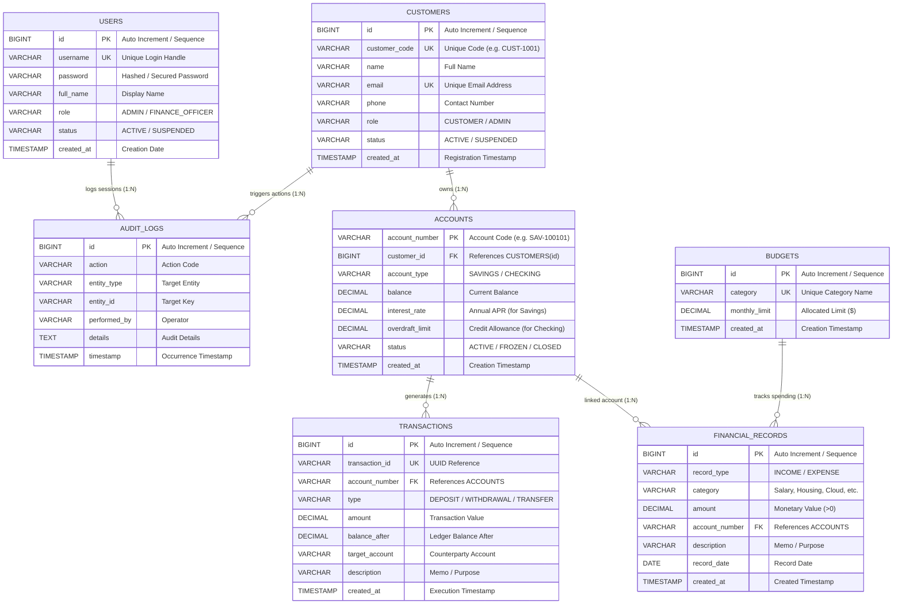

# FinCore - Enterprise OOP & DBMS Capstone Banking & Finance System

[](https://www.oracle.com/java/)
[](https://www.oracle.com/database/)
[](https://docs.oracle.com/javase/tutorial/uiswing/)
[](https://docs.oracle.com/javase/tutorial/jdbc/)
[](https://maven.apache.org/)

An enterprise-grade Java application and Relational Database Management System (DBMS) Capstone Project demonstrating **Object-Oriented Programming (OOP)** paradigms alongside **Relational DBMS** architecture, database-backed authentication, a complete **CRUD module**, a multi-tab **Java Swing Finance Dashboard**, and **Oracle 10g XE** compatibility.

---

## 🏛️ Key System Capabilities

1. **Database-Backed Authentication (Login)**:
   - Authenticates operators directly against the relational `users` table using parameterized SQL `SELECT` queries.
   - Rejects invalid passwords/usernames with audit security logging.
   - Provides seeded quick-login roles (`admin` / `admin123` as Administrator, `asmit` / `password123` as Financial Officer).
2. **Interactive Java Swing Finance Dashboard**:
   - **Tab 1: 📊 Dashboard Overview**: Real-time KPI cards for Total Account Liquidity, Total Income, Total Expenses, and Net Cash Flow.
   - **Tab 2: 💰 Income & Expenses (Complete CRUD Module)**: Full GUI management with `➕ Add Record (INSERT)`, table display with filter `(SELECT)`, `✏️ Edit Record (UPDATE)`, and `🗑️ Delete Record (DELETE)`.
   - **Tab 3: 🏦 Accounts**: Savings (with APR) and Checking (with Overdraft allowance) accounts.
   - **Tab 4: 🎯 Budget Tracker**: Relational JOIN dynamically computing category limit utilization.
   - **Tab 5: 📜 Transactions Ledger**: Immutable double-entry audit history.
   - **Tab 6: 📈 Financial Reports**: Expense category breakdown and percentage shares.
   - **🖥️ Live JDBC SQL & DML Inspector Panel**: Docked bottom console streaming real-time SQL statements, execution duration (ms), and affected rows via the Observer Pattern.
3. **Multi-DBMS Compatibility (Oracle 10g XE, SQLite, MySQL)**:
   - Configurable via `src/main/resources/db.properties`.
   - **Oracle 10g XE**: Includes `schema-oracle10g.sql` and `seed-oracle10g.sql` with Oracle sequences (`seq_users`, `seq_fin_records`, `seq_budgets`), triggers, `NUMBER(15,2)` decimal precision, and `VARCHAR2`.
   - **SQLite**: Zero-configuration embedded database (`fincore_banking.db`) for immediate offline demonstration.
4. **Complete Financial Record CRUD Module**:
   - **`INSERT`**: Creates new Income or Expense records, capturing auto-generated primary keys.
   - **`SELECT`**: Queries single records by ID or lists all records with dynamic category/type filtering.
   - **`UPDATE`**: Edits amounts, categories, accounts, descriptions, and dates.
   - **`DELETE`**: Removes records and verifies deletion from the database.
5. **ACID Transaction Guarantees**:
   - Atomic money transfers with synchronized balances and double-entry transaction records.
   - Automatic rollback with 0 fund loss on overdraft/insufficient funds violations.

---

## 📊 Database Entity-Relationship (ER) Diagram



> 📖 **Full System Diagrams**: Detailed UML Class Diagram, Sequence Diagram, and Schema Data Dictionary are available in [`docs/ERD_AND_UML.md`](docs/ERD_AND_UML.md).  
> 🎤 **Group Presentation Script**: Four-person explanatory presentation speech script is in [`speech.md`](speech.md).

---

## 💎 Object-Oriented Principles (OOP) in Action

| OOP Tenet | Implementation in FinCore |
|---|---|
| **Encapsulation** | Sensitive fields (`balance`, `customerId`, `status`) are strictly private in [`Account`](src/main/java/com/fincore/model/Account.java), [`Customer`](src/main/java/com/fincore/model/Customer.java), and [`FinancialRecord`](src/main/java/com/fincore/model/FinancialRecord.java). Invariants are enforced on deposits, withdrawals, and updates. |
| **Inheritance** | Base class [`User`](src/main/java/com/fincore/model/User.java) is extended by `Customer` and `Admin`. Base class [`Account`](src/main/java/com/fincore/model/Account.java) is extended by [`SavingsAccount`](src/main/java/com/fincore/model/SavingsAccount.java) and [`CheckingAccount`](src/main/java/com/fincore/model/CheckingAccount.java). |
| **Polymorphism** | Runtime dynamic method dispatch: `canWithdraw(amount)` validates minimum balances for Savings accounts vs. credit overdraft for Checking accounts. `calculateMonthlyInterestOrFee()` returns positive APR interest for Savings and negative maintenance fees for Checking. |
| **Abstraction & Repositories** | Data access is separated via interfaces: [`FinancialRecordRepository`](src/main/java/com/fincore/repository/FinancialRecordRepository.java), [`UserRepository`](src/main/java/com/fincore/repository/UserRepository.java), [`AccountRepository`](src/main/java/com/fincore/repository/AccountRepository.java), and [`BudgetRepository`](src/main/java/com/fincore/repository/BudgetRepository.java). |

---

## 🖥️ Capstone Demonstration Workflow

### 1. Launch Options
FinCore supports interactive GUI, full automated verification demo, and terminal CLI:

```bash
# Option 1: Run Full Automated Capstone Demonstration (Recommended for grading)
./run.sh --demo

# Option 2: Launch Java Swing Graphical Interface (Login & Finance Dashboard)
./run.sh --gui

# Option 3: Launch Interactive Terminal Console Menu
./run.sh --cli

# Option 4: Run Complete Test Suite (14 Unit & Integration Tests)
./run.sh --test
```

### 2. Capstone Step-by-Step Demonstration Sequence
When running `./run.sh --demo` (or testing via GUI), the system automatically executes and verifies:
1. **Application Start & Database Connectivity**: Initializes JDBC connection pool to SQLite or Oracle 10g XE.
2. **Database Authentication (Login)**:
   - Tests rejection of invalid credentials.
   - Executes SQL `SELECT ... FROM users WHERE username = ? AND password = ? AND status = 'ACTIVE'`.
   - Logs session in `audit_logs` and grants access.
3. **Open Finance Dashboard**: Loads global liquidity, revenue, expenses, and net cash flow.
4. **Complete CRUD Lifecycle**:
   - **INSERT**: `INSERT INTO financial_records (...) VALUES (...)` $\to$ Returns auto-generated ID `#8`.
   - **SELECT**: `SELECT ... FROM financial_records WHERE id = 8` $\to$ Displays persisted record.
   - **UPDATE**: `UPDATE financial_records SET amount = 585.50, description = '...' WHERE id = 8` $\to$ Confirms row modification.
   - **DELETE**: `DELETE FROM financial_records WHERE id = 8` $\to$ Verifies record removal (0 rows).
5. **Polymorphic Account Modeling**: Savings APR interest credit vs. Checking maintenance fee debit.
6. **ACID Transaction Commit**: $1,500 inter-account transfer with synchronous balance update.
7. **ACID Transaction Rollback**: Intercepts illegal overdraft and rolls back with zero fund leakage.
8. **Relational Analytics**: Customer portfolio JOINs and budget expenditure calculations.

---

## ⚙️ Database Configuration (Oracle 10g XE / SQLite / MySQL)

Edit `src/main/resources/db.properties`:

```properties
# ====================================================================
# FinCore Database Configuration
# ====================================================================

# Default: Zero-configuration embedded SQLite
db.type=sqlite
sqlite.url=jdbc:sqlite:fincore_banking.db

# --------------------------------------------------------------------
# Oracle 10g XE Configuration:
# --------------------------------------------------------------------
# db.type=oracle
# oracle.url=jdbc:oracle:thin:@localhost:1521:xe
# oracle.user=system
# oracle.password=oracle

# --------------------------------------------------------------------
# MySQL Configuration:
# --------------------------------------------------------------------
# db.type=mysql
# mysql.url=jdbc:mysql://localhost:3306/fincore_db?createDatabaseIfNotExist=true
# mysql.user=root
# mysql.password=
```

---

## 📂 Project Structure

```
oop-dbms-capstone/
├── pom.xml                               # Maven build file (ojdbc11, sqlite, mysql, junit5)
├── run.sh                                # Multi-mode execution script (--gui, --demo, --cli, --test)
├── speech.md                             # 4-Person presentation speech & script
├── README.md                             # System manual & technical documentation
├── docs/
│   └── ERD_AND_UML.md                    # ER Diagram, UML Class Diagram, Data Dictionary
├── src/
│   ├── main/
│   │   ├── java/com/fincore/
│   │   │   ├── Main.java                 # System entrypoint, DI wiring & mode detector
│   │   │   ├── config/DatabaseConfig.java# JDBC & properties singleton
│   │   │   ├── db/
│   │   │   │   ├── DatabaseManager.java  # Connection handling & SQL listener
│   │   │   │   └── MigrationRunner.java  # Auto DDL & seed script executor
│   │   │   ├── model/                    # Domain entities
│   │   │   │   ├── AuthUser.java         # User entity for DB authentication
│   │   │   │   ├── FinancialRecord.java  # Income & Expense CRUD entity
│   │   │   │   ├── Budget.java           # Budget category limit entity
│   │   │   │   ├── Account.java          # Abstract account
│   │   │   │   ├── SavingsAccount.java   # Extends Account (APR interest)
│   │   │   │   ├── CheckingAccount.java  # Extends Account (Overdraft limit)
│   │   │   │   ├── Customer.java         # Customer entity
│   │   │   │   ├── Transaction.java      # Ledger record
│   │   │   │   └── AuditLog.java         # Audit log entity
│   │   │   ├── repository/               # Data Access Object contracts
│   │   │   │   ├── UserRepository.java
│   │   │   │   ├── FinancialRecordRepository.java
│   │   │   │   ├── BudgetRepository.java
│   │   │   │   ├── AccountRepository.java
│   │   │   │   ├── CustomerRepository.java
│   │   │   │   ├── TransactionRepository.java
│   │   │   │   └── impl/                 # JDBC Implementations
│   │   │   ├── service/                  # Business & Transaction services
│   │   │   │   ├── AuthService.java      # DB login & session verification
│   │   │   │   ├── FinanceService.java   # CRUD operations & metrics
│   │   │   │   ├── BankingService.java   # ACID transfer coordination
│   │   │   │   └── ReportService.java    # Analytical SQL queries
│   │   │   └── ui/                       # UI Layer
│   │   │       ├── swing/
│   │   │       │   ├── LoginFrame.java   # Swing database login screen
│   │   │       │   ├── FinanceDashboardFrame.java # Multi-tab dashboard
│   │   │       │   └── RecordDialog.java # CRUD INSERT/UPDATE modal
│   │   │       ├── ConsoleMenu.java      # Interactive CLI terminal
│   │   │       └── DemoRunner.java       # Automated Capstone demonstration
│   │   └── resources/
│   │       ├── db.properties             # Database connection settings
│   │       ├── schema-oracle10g.sql      # Oracle 10g XE DDL (sequences & triggers)
│   │       ├── seed-oracle10g.sql        # Oracle 10g XE seed data
│   │       ├── schema-sqlite.sql         # SQLite DDL
│   │       └── seed.sql                  # Seed data
│   └── test/java/com/fincore/
│       ├── AuthIntegrationTest.java      # Database authentication tests
│       ├── FinanceCrudIntegrationTest.java # Complete CRUD lifecycle tests
│       ├── BankingServiceTest.java       # ACID atomicity & rollback tests
│       ├── RepositoryIntegrationTest.java# Analytical JOIN queries
│       └── AccountPolymorphismTest.java  # OOP polymorphism tests
```
