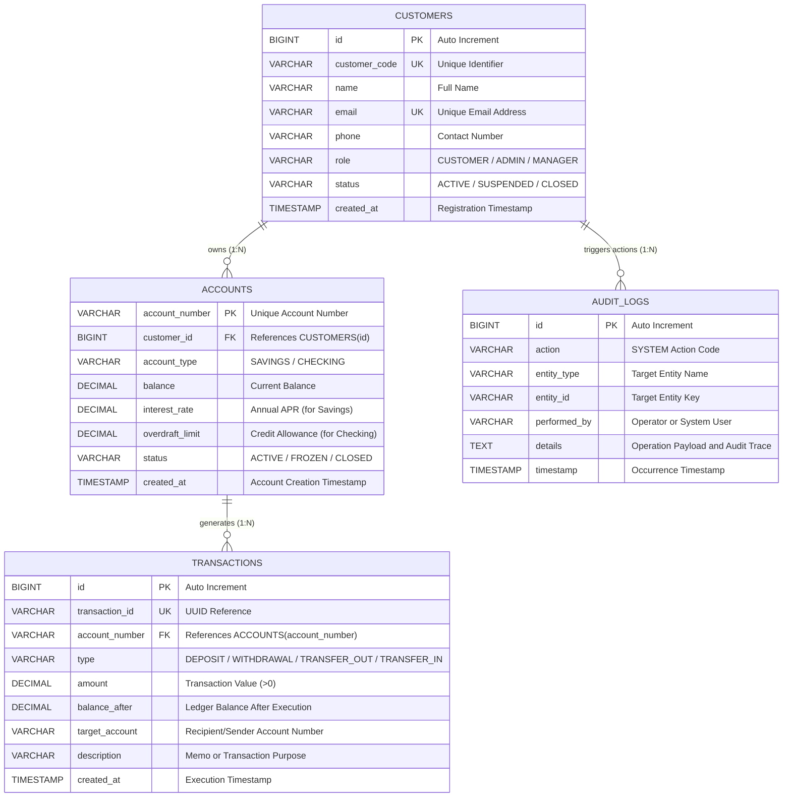
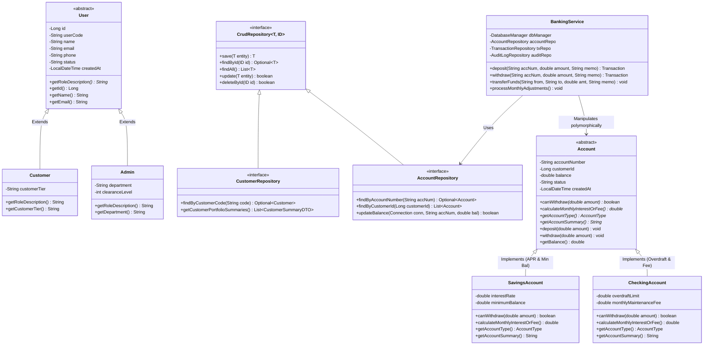
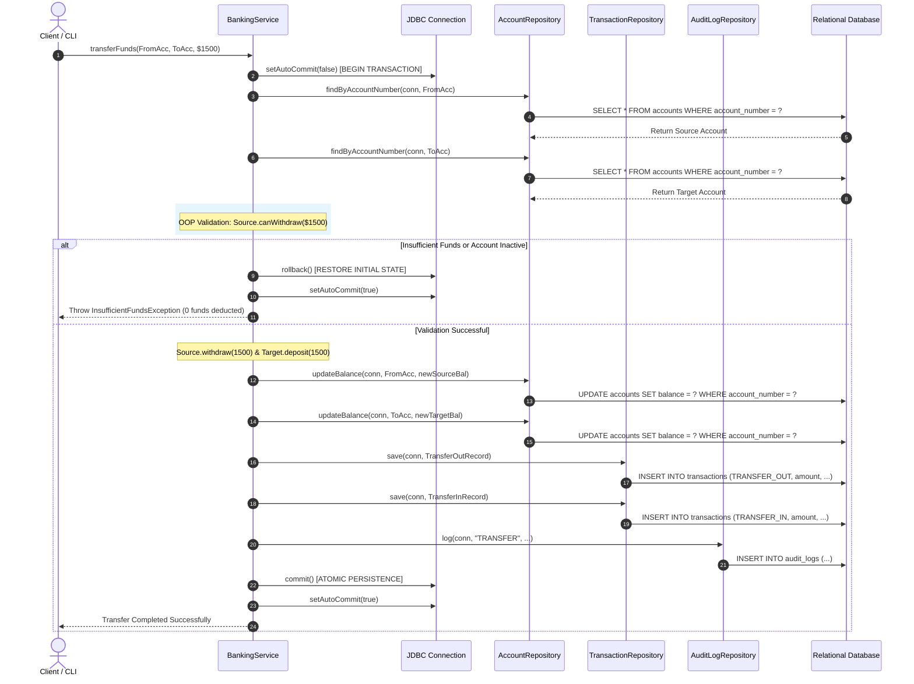
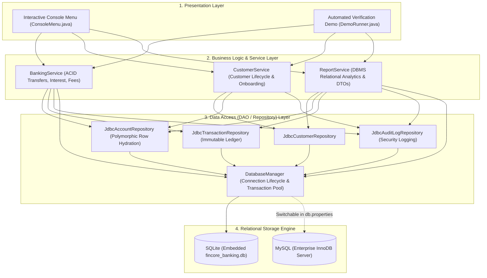

# 📊 FinCore: ER Diagram, UML Class Diagrams & Architectural Design

This document contains complete system diagrams, entity-relationship models, UML class hierarchies, sequence diagrams, and the database schema data dictionary for the **FinCore Banking System Capstone Project**.

---

## 📑 Table of Contents
1. [Entity-Relationship (ER) Diagram](#1-entity-relationship-erd-diagram)
2. [UML Class Diagram (OOP Architecture)](#2-uml-class-diagram-oop-architecture)
3. [ACID Transaction Sequence Diagram](#3-acid-transaction-sequence-diagram)
4. [3-Tier System Architecture Diagram](#4-3-tier-system-architecture-diagram)
5. [Database Data Dictionary & Relational Specification](#5-database-data-dictionary)

---

## 1. Entity-Relationship (ER) Diagram

The following diagram models the relational schema, cardinality, primary keys (`PK`), foreign keys (`FK`), and attributes.

### Relational Integrity Rules:
* **One-to-Many (`1:N`) Customers to Accounts**: A customer can maintain multiple bank accounts (e.g., Savings and Checking), but each account belongs to exactly one customer (`ON DELETE CASCADE`).
* **One-to-Many (`1:N`) Accounts to Transactions**: An account generates multiple ledger movements, but each transaction entry strictly belongs to one primary account.
* **Auditability**: All state mutations generate append-only logs in `audit_logs`.

---

## 2. UML Class Diagram (OOP Architecture)

This diagram illustrates **Abstraction**, **Inheritance**, **Polymorphism**, and **Dependency Inversion** between the Presentation, Service, Repository, and Model layers.

---

## 3. ACID Transaction Sequence Diagram

This sequence diagram details the end-to-end execution of `BankingService.transferFunds()` demonstrating **DBMS Atomicity**, **Rollback protection**, and **Double-Entry Ledger recording**.

---

## 4. 3-Tier System Architecture Diagram

---

## 5. Database Data Dictionary

### Table 1: `customers`
| Column Name | Data Type | Constraints | Description |
|---|---|---|---|
| `id` | `INTEGER` / `BIGINT` | `PRIMARY KEY`, `AUTOINCREMENT` | Unique internal customer ID |
| `customer_code` | `VARCHAR(30)` | `NOT NULL`, `UNIQUE` | Business identifier (e.g., `CUST-1001`) |
| `name` | `VARCHAR(100)` | `NOT NULL` | Customer's full name |
| `email` | `VARCHAR(100)` | `NOT NULL`, `UNIQUE` | Unique contact email address |
| `phone` | `VARCHAR(30)` | `NULLABLE` | Telephone contact number |
| `role` | `VARCHAR(20)` | `NOT NULL`, `DEFAULT 'CUSTOMER'` | Role classification (`CUSTOMER`, `ADMIN`) |
| `status` | `VARCHAR(20)` | `NOT NULL`, `DEFAULT 'ACTIVE'` | Status (`ACTIVE`, `SUSPENDED`, `CLOSED`) |
| `created_at` | `TIMESTAMP` | `DEFAULT CURRENT_TIMESTAMP` | Account creation timestamp |

### Table 2: `accounts`
| Column Name | Data Type | Constraints | Description |
|---|---|---|---|
| `account_number` | `VARCHAR(30)` | `PRIMARY KEY` | Unique account string (e.g. `SAV-100101`) |
| `customer_id` | `INTEGER` / `BIGINT` | `NOT NULL`, `FOREIGN KEY` | References `customers(id)` with `CASCADE` |
| `account_type` | `VARCHAR(20)` | `NOT NULL`, `CHECK (SAVINGS/CHECKING)` | Discriminator for polymorphic class mapping |
| `balance` | `DECIMAL(15,2)` | `NOT NULL`, `DEFAULT 0.00` | Account ledger balance |
| `interest_rate` | `DECIMAL(5,2)` | `DEFAULT 0.00` | Annual interest percentage (for Savings) |
| `overdraft_limit`| `DECIMAL(15,2)` | `DEFAULT 0.00` | Overdraft credit allowance (for Checking) |
| `status` | `VARCHAR(20)` | `NOT NULL`, `DEFAULT 'ACTIVE'` | Operational status (`ACTIVE`, `FROZEN`, etc.) |
| `created_at` | `TIMESTAMP` | `DEFAULT CURRENT_TIMESTAMP` | Account creation timestamp |

### Table 3: `transactions`
| Column Name | Data Type | Constraints | Description |
|---|---|---|---|
| `id` | `INTEGER` / `BIGINT` | `PRIMARY KEY`, `AUTOINCREMENT` | Internal transaction ID |
| `transaction_id` | `VARCHAR(50)` | `NOT NULL`, `UNIQUE` | External UUID reference identifier |
| `account_number` | `VARCHAR(30)` | `NOT NULL`, `FOREIGN KEY` | References `accounts(account_number)` with `CASCADE` |
| `type` | `VARCHAR(20)` | `NOT NULL` | Type: `DEPOSIT`, `WITHDRAWAL`, `TRANSFER_OUT`, etc. |
| `amount` | `DECIMAL(15,2)` | `NOT NULL`, `CHECK (amount > 0)` | Absolute value transferred |
| `balance_after` | `DECIMAL(15,2)` | `NOT NULL` | Balance of the account after this transaction |
| `target_account` | `VARCHAR(30)` | `NULLABLE` | Destination/source account number for transfers |
| `description` | `VARCHAR(255)` | `NULLABLE` | Transfer memo or payment purpose |
| `created_at` | `TIMESTAMP` | `DEFAULT CURRENT_TIMESTAMP` | Transaction execution timestamp |

### Table 4: `audit_logs`
| Column Name | Data Type | Constraints | Description |
|---|---|---|---|
| `id` | `INTEGER` / `BIGINT` | `PRIMARY KEY`, `AUTOINCREMENT` | Primary key |
| `action` | `VARCHAR(50)` | `NOT NULL` | Action code (`TRANSFER`, `CREATE_ACCOUNT`, etc.) |
| `entity_type` | `VARCHAR(50)` | `NOT NULL` | Entity name (`CUSTOMER`, `ACCOUNT`, `TRANSACTION`) |
| `entity_id` | `VARCHAR(50)` | `NOT NULL` | Identifier of affected record |
| `performed_by` | `VARCHAR(100)` | `NOT NULL` | User or automated process |
| `details` | `TEXT` | `NULLABLE` | Human-readable log details |
| `timestamp` | `TIMESTAMP` | `DEFAULT CURRENT_TIMESTAMP` | Log record timestamp |

---

## 6. Database Indexes for Performance Optimization

To guarantee high throughput and minimize scan overhead on high-frequency lookups, the following B-Tree indexes are defined:

1. **`idx_accounts_customer_id`** on `accounts(customer_id)`: Enables instant sub-millisecond retrieval of all accounts owned by a customer.
2. **`idx_transactions_account_num`** on `transactions(account_number)`: Optimizes account statement lookups and transaction history.
3. **`idx_transactions_created_at`** on `transactions(created_at)`: Optimizes date-filtered reporting and month-end ledger audits.
4. **`idx_audit_logs_timestamp`** on `audit_logs(timestamp)`: Optimizes regulatory compliance history searches.
