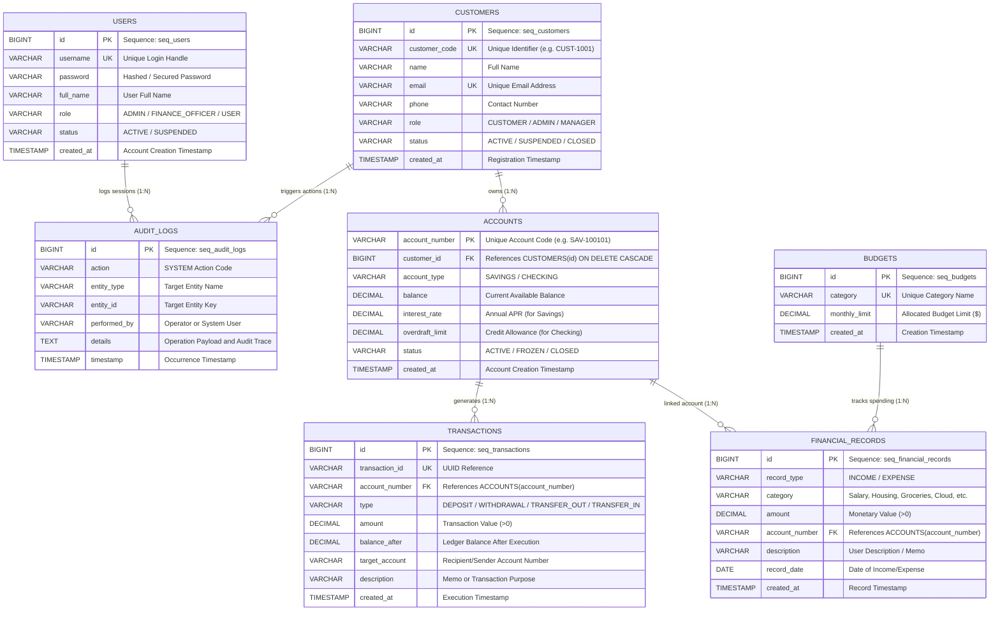
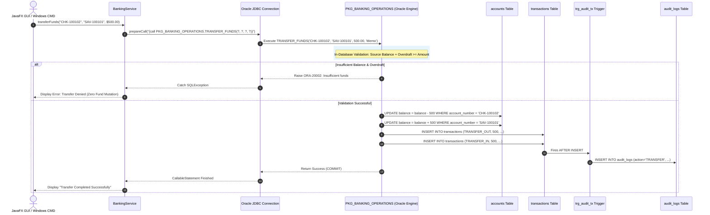

# 📊 FinCore: Entity-Relationship (ER) Diagram, UML Class Diagrams & Architectural Design

> **Project Name:** FinCore - Enterprise Banking & Finance Management System  
> **Tech Stack:** Java 21, JavaFX 21, Oracle Database in Docker (`gvenzl/oracle-free:23-slim`), Oracle JDBC (`ojdbc11:23.26.3.0.0`), PL/SQL Packages, Triggers, Views  

This document provides complete architectural blueprints, entity-relationship models, UML class hierarchies, sequence diagrams, PL/SQL package specifications, and the database data dictionary for the **FinCore Banking & Finance System Capstone Project**.

---

## 📑 Table of Contents
1. [Entity-Relationship (ER) Diagram](#1-entity-relationship-erd-diagram)
2. [Advanced DBMS Architecture: PL/SQL, Triggers & Views](#2-advanced-dbms-architecture-plsql-triggers--views)
3. [UML Class Diagram (OOP Architecture)](#3-uml-class-diagram-oop-architecture)
4. [JavaFX 21 UI Component Hierarchy](#4-javafx-21-ui-component-hierarchy)
5. [Complete Financial Record CRUD Lifecycle](#5-complete-financial-record-crud-lifecycle)
6. [PL/SQL & ACID Transaction Sequence Diagram](#6-plsql--acid-transaction-sequence-diagram)
7. [Enterprise 3-Tier System Architecture Diagram](#7-enterprise-3-tier-system-architecture-diagram)
8. [Database Data Dictionary & Relational Specification](#8-database-data-dictionary)
9. [Docker Oracle Database Deployment & Configuration](#9-docker-oracle-database-deployment--configuration)

---

## 1. Entity-Relationship (ER) Diagram

The following diagram models the complete relational schema, foreign key relationships, cardinalities, and attributes for **Oracle Database (Free / 23c / 10g)**:



### Relational Integrity Rules:
* **One-to-Many (`1:N`) Customers to Accounts**: A customer can hold multiple accounts (Savings and Checking), cascading deletions (`ON DELETE CASCADE`).
* **One-to-Many (`1:N`) Accounts to Transactions**: Every transaction belongs to an authorized account.
* **One-to-Many (`1:N`) Accounts to Financial Records**: Every income or expense entry links to a valid bank account.
* **Budget Tracking via Relational Views**: Monthly expenditures per category are calculated dynamically by joining `budgets` with `financial_records`.
* **Database-Backed Authentication**: The `users` table authenticates operators via parameterized SQL `SELECT` queries before granting access to the system.

---

## 2. Advanced DBMS Architecture: PL/SQL, Triggers & Views

FinCore implements native in-database intelligence using Oracle PL/SQL stored procedures, business triggers, and analytical views.

### 1. PL/SQL Stored Package: `PKG_BANKING_OPERATIONS`

```sql
CREATE OR REPLACE PACKAGE PKG_BANKING_OPERATIONS AS
    -- Multi-account atomic fund transfer with balance checks
    PROCEDURE TRANSFER_FUNDS(
        p_source_account IN VARCHAR2,
        p_target_account IN VARCHAR2,
        p_amount         IN NUMBER,
        p_description    IN VARCHAR2
    );

    -- Atomic financial record insertion with validation
    PROCEDURE ADD_FINANCIAL_RECORD(
        p_record_type    IN VARCHAR2,
        p_category       IN VARCHAR2,
        p_amount         IN NUMBER,
        p_account_number IN VARCHAR2,
        p_description    IN VARCHAR2,
        p_record_date    IN DATE
    );

    -- Calculate total net worth across all customer accounts
    FUNCTION GET_CUSTOMER_NET_WORTH(p_customer_id IN NUMBER) RETURN NUMBER;

    -- Calculate total spending in a category for current month
    FUNCTION GET_CATEGORY_SPENT(p_category IN VARCHAR2) RETURN NUMBER;
END PKG_BANKING_OPERATIONS;
/
```

### 2. Automated Database Triggers

- **`trg_audit_tx` (After Insert on `transactions`):** Automatically creates an immutable entry in `audit_logs` whenever a deposit, withdrawal, or transfer occurs:
  ```sql
  CREATE OR REPLACE TRIGGER trg_audit_tx
  AFTER INSERT ON transactions
  FOR EACH ROW
  BEGIN
      INSERT INTO audit_logs (action, entity_type, entity_id, performed_by, details)
      VALUES (:NEW.type, 'TRANSACTION', :NEW.transaction_id, 'ORACLE_TRIGGER',
              'Amount: ' || :NEW.amount || ' | Account: ' || :NEW.account_number);
  END;
  /
  ```
- **`trg_check_budget_alert` (Before Insert on `financial_records`):** Inspects incoming expense records and logs warnings if spending exceeds allocated budget limits.

### 3. Relational Views

- **`v_customer_portfolio`**: Aggregates customer balances, active account counts, and computed net worth:
  ```sql
  CREATE OR REPLACE VIEW v_customer_portfolio AS
  SELECT c.id AS customer_id, c.customer_code, c.name, c.email,
         COUNT(a.account_number) AS total_accounts,
         COALESCE(SUM(a.balance), 0) AS total_balance
  FROM customers c
  LEFT JOIN accounts a ON c.id = a.customer_id
  GROUP BY c.id, c.customer_code, c.name, c.email;
  ```
- **`v_budget_summary`**: Dynamic budget tracking view computing limit, actual spent, remaining budget, percentage used, and alert status (`OK`, `WARNING`, `EXCEEDED`).
- **`v_account_ledger`**: Full transaction ledger joined with customer names and account types.
- **`v_monthly_financial_report`**: Month-by-month cash flow analysis (Total Income, Total Expenses, Net Margin).

---

## 3. UML Class Diagram (OOP Architecture)

```mermaid
classDiagram
    %% Hierarchy: User Domain
    class User {
        <<abstract>>
        -Long id
        -String userCode
        -String name
        -String email
        -String phone
        -String status
        -LocalDateTime createdAt
        +getRoleDescription()* String
        +getId() Long
        +getName() String
        +getEmail() String
    }

    class Customer {
        -String customerTier
        +getRoleDescription() String
        +getCustomerTier() String
    }

    class Admin {
        -String department
        -int clearanceLevel
        +getRoleDescription() String
        +getDepartment() String
    }

    class AuthUser {
        -Long id
        -String username
        -String password
        -String fullName
        -String role
        -String status
        -LocalDateTime createdAt
        +getId() Long
        +getUsername() String
        +getRole() String
    }

    User <|-- Customer : Extends
    User <|-- Admin : Extends

    %% Hierarchy: Account Domain
    class Account {
        <<abstract>>
        -String accountNumber
        -Long customerId
        -double balance
        -String status
        -LocalDateTime createdAt
        +canWithdraw(double amount)* boolean
        +calculateMonthlyInterestOrFee()* double
        +getAccountType()* AccountType
        +getAccountSummary()* String
        +deposit(double amount) void
        +withdraw(double amount) void
        +getBalance() double
    }

    class SavingsAccount {
        -double interestRate
        -double minimumBalance
        +canWithdraw(double amount) boolean
        +calculateMonthlyInterestOrFee() double
        +getAccountType() AccountType
        +getAccountSummary() String
    }

    class CheckingAccount {
        -double overdraftLimit
        -double monthlyMaintenanceFee
        +canWithdraw(double amount) boolean
        +calculateMonthlyInterestOrFee() double
        +getAccountType() AccountType
        +getAccountSummary() String
    }

    Account <|-- SavingsAccount : Implements (APR & Min Bal)
    Account <|-- CheckingAccount : Implements (Overdraft & Fee)

    %% Financial Records & Budget
    class FinancialRecord {
        -Long id
        -Type recordType
        -String category
        -double amount
        -String accountNumber
        -String description
        -LocalDate recordDate
        +getId() Long
        +getAmount() double
    }

    class Budget {
        -Long id
        -String category
        -double monthlyLimit
        -double spentAmount
        +getRemainingAmount() double
        +getPercentageUsed() double
        +isExceeded() boolean
    }

    %% Repositories
    class CrudRepository~T, ID~ {
        <<interface>>
        +save(T entity) T
        +findById(ID id) Optional~T~
        +findAll() List~T~
        +update(T entity) boolean
        +deleteById(ID id) boolean
    }

    class FinancialRecordRepository {
        <<interface>>
        +findByType(Type type) List~FinancialRecord~
        +getTotalIncome() double
        +getTotalExpenses() double
        +getCategoryBreakdown(Type type) Map~String, Double~
    }

    class UserRepository {
        <<interface>>
        +authenticate(String user, String pass) Optional~AuthUser~
        +findByUsername(String user) Optional~AuthUser~
    }

    CrudRepository <|-- FinancialRecordRepository
    CrudRepository <|-- UserRepository

    %% Services
    class AuthService {
        -UserRepository userRepo
        -AuditLogRepository auditRepo
        +login(String user, String pass) AuthUser
        +logout() void
        +getCurrentUser() AuthUser
    }

    class BankingService {
        -AccountRepository accountRepo
        -TransactionRepository txRepo
        -AuditLogRepository auditRepo
        +transferFunds(...) boolean
        +transferFundsViaPlSql(...) boolean
        +deposit(...) boolean
        +withdraw(...) boolean
    }

    class FinanceService {
        -FinancialRecordRepository finRecordRepo
        -BudgetRepository budgetRepo
        -AccountRepository accountRepo
        +addRecord(...) FinancialRecord
        +updateRecord(...) boolean
        +deleteRecord(Long id) boolean
        +getTotalAccountBalances() double
        +getAllBudgetsWithSpending() List~Budget~
    }

    AuthService --> UserRepository : Uses
    FinanceService --> FinancialRecordRepository : Executes CRUD
    BankingService --> AccountRepository : Coordinates Transfers
```



---

## 4. JavaFX 21 UI Component Hierarchy

```mermaid
graph TD
    subgraph Presentation Layer (JavaFX 21)
        MainApp[MainApp: Application Entry Point] -->|Launches| LoginView[LoginView: Oracle DB Authentication]
        LoginView -->|Credentials Valid| Dashboard[FinanceDashboardView: Main Stage]
        
        Dashboard --> Tab1[Tab 1: 📊 Dashboard Overview Cards & Charts]
        Dashboard --> Tab2[Tab 2: 💰 Financial Records CRUD TableView]
        Dashboard --> Tab3[Tab 3: 🏦 Accounts Overview TableView]
        Dashboard --> Tab4[Tab 4: 🎯 Budget Tracker Gauges & List]
        Dashboard --> Tab5[Tab 5: 📜 Transactions Ledger TableView]
        Dashboard --> Tab6[Tab 6: 📈 Relational Views TableView]
        Dashboard --> Tab7[Tab 7: ⚡ Live Interactive SQL Console]
        
        Tab2 -->|➕ Add / ✏️ Edit| Dialog[RecordDialog: INSERT / UPDATE Modal]
        Dashboard -->|💸 Transfer| TxDialog[TransferDialog: PL/SQL Transfer Modal]
        
        Dashboard --> BottomBar[🖥️ Live SQL / PLSQL Stream Console & Latency Gauge]
    end
    
    subgraph Observer Pattern
        DBMgr[DatabaseManager] -->|SqlListener Events| BottomBar
    end
```

---

## 5. Complete Financial Record CRUD Lifecycle

| CRUD Step | User Action in JavaFX UI | JDBC / DBMS Operation | Generated SQL / DML Syntax | Verification |
|---|---|---|---|---|
| **INSERT (Create)** | Click `➕ Add Record` $\to$ Enter Category, Amount, Account, Memo $\to$ Save | `PreparedStatement.executeUpdate()` or `PKG_BANKING_OPERATIONS.ADD_FINANCIAL_RECORD` | `INSERT INTO financial_records (record_type, category, amount, account_number, description, record_date) VALUES (?, ?, ?, ?, ?, ?)` | Oracle Sequence generates new `#ID`; row appears in TableView; KPI cards update |
| **SELECT (Read)** | Select tab / click `🔄 Refresh` / filter by Type | `PreparedStatement.executeQuery()` | `SELECT id, record_type, category, amount, account_number, description, record_date FROM financial_records ORDER BY id DESC` | Populates `ObservableList<FinancialRecord>`; rendered in JavaFX TableView |
| **UPDATE (Edit)** | Select row in table $\to$ Click `✏️ Edit Record` $\to$ Modify amount/memo $\to$ Save | `PreparedStatement.executeUpdate()` | `UPDATE financial_records SET record_type=?, category=?, amount=?, account_number=?, description=?, record_date=? WHERE id=?` | Affected rows: 1; Table and Budget variance immediately update |
| **DELETE (Remove)** | Select row in table $\to$ Click `🗑️ Delete Record` $\to$ Confirm prompt | `PreparedStatement.executeUpdate()` | `DELETE FROM financial_records WHERE id = ?` | Affected rows: 1; Row removed from DBMS and UI; balances recalibrated |

---

## 6. PL/SQL & ACID Transaction Sequence Diagram

This diagram demonstrates inter-account fund transfers utilizing Oracle PL/SQL package `PKG_BANKING_OPERATIONS.TRANSFER_FUNDS` with automated trigger auditing:



---

## 7. Enterprise 3-Tier System Architecture Diagram

```mermaid
graph TD
    subgraph Presentation Tier (Windows CMD & Desktop)
        UI_GUI["🖥️ JavaFX 21 GUI (MainApp, LoginView, Dashboard, CRUD Dialogs)"]
        UI_CLI["💻 Windows CMD Terminal (run-cli.bat / ConsoleMenu)"]
        UI_DEMO["🚀 Capstone Automated Verification (run-demo.bat / DemoRunner)"]
    end

    subgraph Business Service Tier
        AUTH_SVC["AuthService (User Authentication & Session Audit)"]
        FIN_SVC["FinanceService (CRUD Management & Aggregations)"]
        BANK_SVC["BankingService (PL/SQL Transfers & ACID Fallback)"]
        CUST_SVC["CustomerService (Customer Onboarding & Accounts)"]
        RPT_SVC["ReportService (Relational Views & Portfolio Analytics)"]
    end

    subgraph Data Access Repository Tier
        USER_REPO["UserRepository (JdbcUserRepository)"]
        FIN_REPO["FinancialRecordRepository (JdbcFinancialRecordRepository)"]
        BUDGET_REPO["BudgetRepository (JdbcBudgetRepository)"]
        ACC_REPO["AccountRepository (JdbcAccountRepository)"]
        TX_REPO["TransactionRepository (JdbcTransactionRepository)"]
        AUDIT_REPO["AuditLogRepository (JdbcAuditLogRepository)"]
    end

    subgraph Relational DBMS Tier
        DB_CONN["DatabaseManager (Connection Pool & SQL Observer)"]
        ORACLE_DOCKER[("🐳 Oracle Database Free in Docker (Port 1521 / FREEPDB1)")]
    end

    UI_GUI --> AUTH_SVC
    UI_GUI --> FIN_SVC
    UI_GUI --> BANK_SVC
    UI_GUI --> RPT_SVC
    UI_CLI --> BANK_SVC
    UI_DEMO --> AUTH_SVC
    UI_DEMO --> FIN_SVC

    AUTH_SVC --> USER_REPO
    FIN_SVC --> FIN_REPO
    FIN_SVC --> BUDGET_REPO
    BANK_SVC --> ACC_REPO
    BANK_SVC --> TX_REPO
    BANK_SVC --> AUDIT_REPO
    RPT_SVC --> DB_CONN

    USER_REPO --> DB_CONN
    FIN_REPO --> DB_CONN
    BUDGET_REPO --> DB_CONN
    ACC_REPO --> DB_CONN
    TX_REPO --> DB_CONN
    AUDIT_REPO --> DB_CONN

    DB_CONN -->|ojdbc11:23.26.3.0.0| ORACLE_DOCKER
```

---

## 8. Database Data Dictionary

### Table: `users`
| Column Name | Data Type (Oracle) | Constraints | Description |
|---|---|---|---|
| `id` | `NUMBER(19)` | `PRIMARY KEY` (via `seq_users`) | Unique User ID |
| `username` | `VARCHAR2(50)` | `NOT NULL UNIQUE` | Login handle |
| `password` | `VARCHAR2(255)` | `NOT NULL` | Secured password |
| `full_name` | `VARCHAR2(100)` | `NOT NULL` | Display Name |
| `role` | `VARCHAR2(30)` | `DEFAULT 'USER'` | `ADMIN`, `FINANCE_OFFICER` |
| `status` | `VARCHAR2(20)` | `DEFAULT 'ACTIVE'` | `ACTIVE`, `SUSPENDED` |
| `created_at` | `TIMESTAMP` | `DEFAULT CURRENT_TIMESTAMP` | Account Creation Date |

### Table: `financial_records`
| Column Name | Data Type (Oracle) | Constraints | Description |
|---|---|---|---|
| `id` | `NUMBER(19)` | `PRIMARY KEY` (via `seq_fin_records`) | Primary Key |
| `record_type` | `VARCHAR2(20)` | `CHECK IN ('INCOME', 'EXPENSE')` | Financial record category |
| `category` | `VARCHAR2(50)` | `NOT NULL` | Revenue or expense item |
| `amount` | `NUMBER(15,2)` | `CHECK (amount > 0)` | Decimal currency value |
| `account_number` | `VARCHAR2(30)` | `NOT NULL REFERENCES accounts` | Source/Destination account |
| `description` | `VARCHAR2(255)` | - | Descriptive memo |
| `record_date` | `DATE` | `NOT NULL` | Accounting date |
| `created_at` | `TIMESTAMP` | `DEFAULT CURRENT_TIMESTAMP` | System insertion timestamp |

---

## 9. Docker Oracle Database Deployment & Configuration

### Docker Compose Service Definition:
```yaml
version: '3.8'
services:
  fincore-oracle-db:
    image: gvenzl/oracle-free:23-slim
    container_name: fincore-oracle-db
    ports:
      - "1521:1521"
    environment:
      - ORACLE_PASSWORD=oracle
      - APP_USER=fincore_user
      - APP_USER_PASSWORD=fincore_pass
    volumes:
      - ./init-scripts:/container-entrypoint-initdb.d
```

### Connection Properties (`src/main/resources/db.properties`):
```properties
db.type=oracle
oracle.url=jdbc:oracle:thin:@localhost:1521/FREEPDB1
oracle.user=fincore_user
oracle.password=fincore_pass
```
