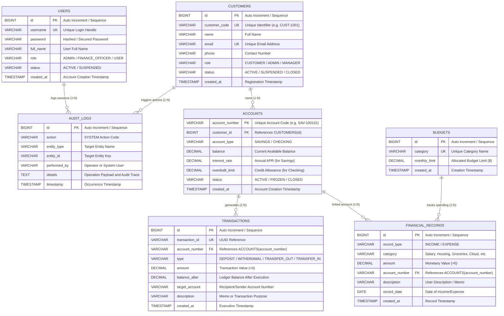
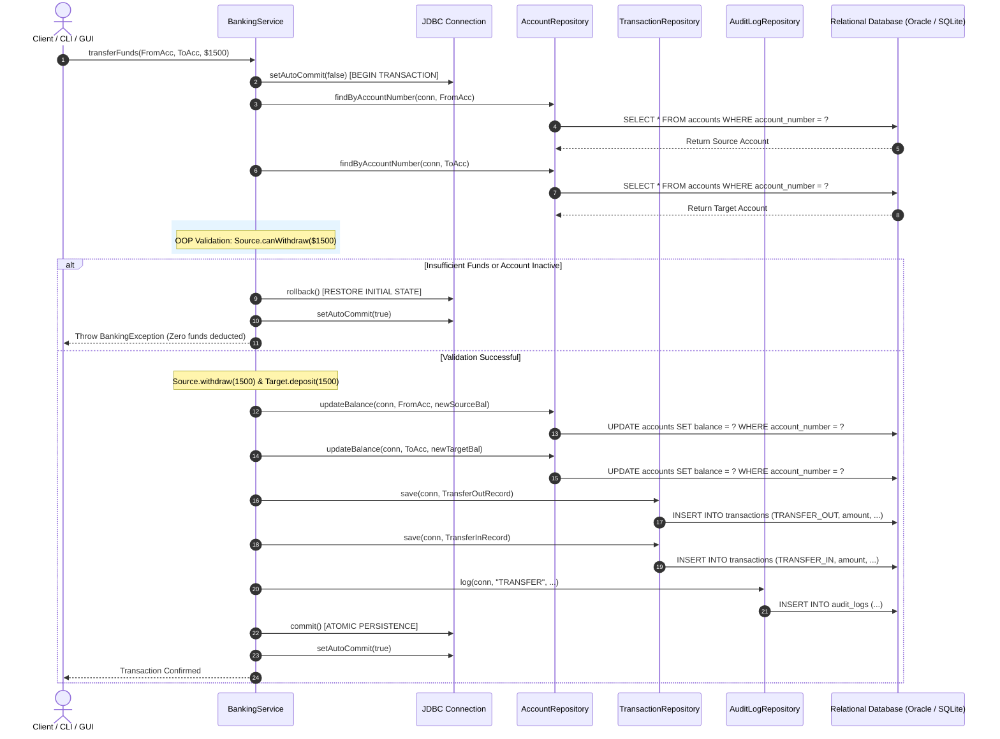
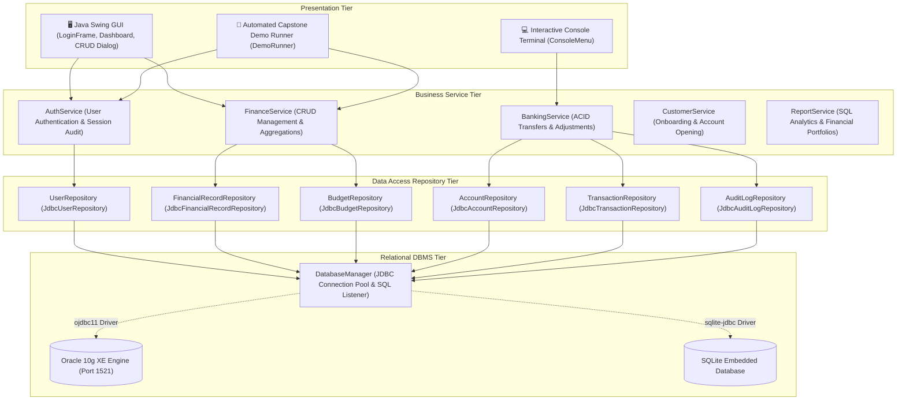

# 📊 FinCore: ER Diagram, UML Class Diagrams & Architectural Design

This document contains complete system diagrams, entity-relationship models, UML class hierarchies, sequence diagrams, and the database schema data dictionary for the **FinCore Banking & Finance System Capstone Project**.

---

## 📑 Table of Contents
1. [Entity-Relationship (ER) Diagram](#1-entity-relationship-erd-diagram)
2. [UML Class Diagram (OOP Architecture)](#2-uml-class-diagram-oop-architecture)
3. [Java Swing GUI Component Hierarchy](#3-java-swing-gui-component-hierarchy)
4. [CRUD Module & Real-time SQL Lifecycle](#4-crud-module--real-time-sql-lifecycle)
5. [ACID Transaction Sequence Diagram](#5-acid-transaction-sequence-diagram)
6. [3-Tier System Architecture Diagram](#6-3-tier-system-architecture-diagram)
7. [Database Data Dictionary & Relational Specification](#7-database-data-dictionary)
8. [Oracle 10g XE Configuration & Sequences](#8-oracle-10g-xe-configuration--sequences)

---

## 1. Entity-Relationship (ER) Diagram

The following diagram models the complete relational schema, foreign key relationships, cardinalities, and attributes for **Oracle 10g XE** / SQLite:



### Relational Integrity Rules:
* **One-to-Many (`1:N`) Customers to Accounts**: A customer can hold multiple accounts (Savings and Checking), cascading deletions (`ON DELETE CASCADE`).
* **One-to-Many (`1:N`) Accounts to Transactions**: Every transaction belongs to an authorized account.
* **One-to-Many (`1:N`) Accounts to Financial Records**: Every income or expense entry links to a valid bank account.
* **Budget Tracking via SQL JOINs**: Monthly expenditures per category are calculated on the fly by joining `budgets` with `financial_records`.
* **Database-Backed Authentication**: The `users` table authenticates operators via parameterized SQL `SELECT` queries before granting access to the system.

---

## 2. UML Class Diagram (OOP Architecture)

```mermaid
classDiagram
    %% Hierarchy: User Domain
    class User {
        <<abstract>>
        -Long id
        -String userCode
        -String name
        -String email
        -String phone
        -String status
        -LocalDateTime createdAt
        +getRoleDescription()* String
        +getId() Long
        +getName() String
        +getEmail() String
    }

    class Customer {
        -String customerTier
        +getRoleDescription() String
        +getCustomerTier() String
    }

    class Admin {
        -String department
        -int clearanceLevel
        +getRoleDescription() String
        +getDepartment() String
    }

    class AuthUser {
        -Long id
        -String username
        -String password
        -String fullName
        -String role
        -String status
        -LocalDateTime createdAt
        +getId() Long
        +getUsername() String
        +getRole() String
    }

    User <|-- Customer : Extends
    User <|-- Admin : Extends

    %% Hierarchy: Account Domain
    class Account {
        <<abstract>>
        -String accountNumber
        -Long customerId
        -double balance
        -String status
        -LocalDateTime createdAt
        +canWithdraw(double amount)* boolean
        +calculateMonthlyInterestOrFee()* double
        +getAccountType()* AccountType
        +getAccountSummary()* String
        +deposit(double amount) void
        +withdraw(double amount) void
        +getBalance() double
    }

    class SavingsAccount {
        -double interestRate
        -double minimumBalance
        +canWithdraw(double amount) boolean
        +calculateMonthlyInterestOrFee() double
        +getAccountType() AccountType
        +getAccountSummary() String
    }

    class CheckingAccount {
        -double overdraftLimit
        -double monthlyMaintenanceFee
        +canWithdraw(double amount) boolean
        +calculateMonthlyInterestOrFee() double
        +getAccountType() AccountType
        +getAccountSummary() String
    }

    Account <|-- SavingsAccount : Implements (APR & Min Bal)
    Account <|-- CheckingAccount : Implements (Overdraft & Fee)

    %% Financial Records & Budget
    class FinancialRecord {
        -Long id
        -Type recordType
        -String category
        -double amount
        -String accountNumber
        -String description
        -LocalDate recordDate
        +getId() Long
        +getAmount() double
    }

    class Budget {
        -Long id
        -String category
        -double monthlyLimit
        -double spentAmount
        +getRemainingAmount() double
        +getPercentageUsed() double
        +isExceeded() boolean
    }

    %% Repositories
    class CrudRepository~T, ID~ {
        <<interface>>
        +save(T entity) T
        +findById(ID id) Optional~T~
        +findAll() List~T~
        +update(T entity) boolean
        +deleteById(ID id) boolean
    }

    class FinancialRecordRepository {
        <<interface>>
        +findByType(Type type) List~FinancialRecord~
        +getTotalIncome() double
        +getTotalExpenses() double
        +getCategoryBreakdown(Type type) Map~String, Double~
    }

    class UserRepository {
        <<interface>>
        +authenticate(String user, String pass) Optional~AuthUser~
        +findByUsername(String user) Optional~AuthUser~
    }

    CrudRepository <|-- FinancialRecordRepository
    CrudRepository <|-- UserRepository

    %% Services
    class AuthService {
        -UserRepository userRepo
        -AuditLogRepository auditRepo
        +login(String user, String pass) AuthUser
        +logout() void
        +getCurrentUser() AuthUser
    }

    class FinanceService {
        -FinancialRecordRepository finRecordRepo
        -BudgetRepository budgetRepo
        -AccountRepository accountRepo
        +addRecord(...) FinancialRecord
        +updateRecord(...) boolean
        +deleteRecord(Long id) boolean
        +getTotalAccountBalances() double
        +getAllBudgetsWithSpending() List~Budget~
    }

    AuthService --> UserRepository : Uses
    FinanceService --> FinancialRecordRepository : Executes CRUD
```



---

## 3. Java Swing GUI Component Hierarchy

```mermaid
graph TD
    subgraph Presentation Layer (Java Swing)
        Main[Main.java Bootstrap] -->|Launches| LoginFrame[LoginFrame: DB Authentication]
        LoginFrame -->|Credentials Valid| Dashboard[FinanceDashboardFrame: Main App]
        
        Dashboard --> Tab1[Tab 1: 📊 Dashboard Overview Cards]
        Dashboard --> Tab2[Tab 2: 💰 Income & Expenses CRUD Table]
        Dashboard --> Tab3[Tab 3: 🏦 Accounts Overview]
        Dashboard --> Tab4[Tab 4: 🎯 Budget Tracker]
        Dashboard --> Tab5[Tab 5: 📜 Transactions Ledger]
        Dashboard --> Tab6[Tab 6: 📈 Financial Reports]
        
        Tab2 -->|➕ Add / ✏️ Edit| Dialog[RecordDialog: INSERT / UPDATE Modal]
        
        Dashboard --> SqlConsole[🖥️ Live JDBC SQL/DML Inspector Panel]
    end
    
    subgraph Observer Pattern
        DBMgr[DatabaseManager] -->|SqlListener Events| SqlConsole
    end
```

---

## 4. CRUD Module & Real-time SQL Lifecycle

| CRUD Step | User Action in UI | JDBC Operation | Generated SQL / DML Syntax | Result / Verification |
|---|---|---|---|---|
| **INSERT (Create)** | Click `➕ Add Record` $\to$ Enter Category, Amount, Account, Memo $\to$ Save | `PreparedStatement.executeUpdate()` | `INSERT INTO financial_records (record_type, category, amount, account_number, description, record_date) VALUES (?, ?, ?, ?, ?, ?)` | Auto-generated PK `#ID` returned; row added to JTable |
| **SELECT (Read)** | Select table tab / click `🔄 Refresh` / filter by Income or Expense | `PreparedStatement.executeQuery()` | `SELECT id, record_type, category, amount, account_number, description, record_date FROM financial_records WHERE id = ?` | Populates `DefaultTableModel`; rows displayed in UI |
| **UPDATE (Edit)** | Select row in table $\to$ Click `✏️ Edit Record` $\to$ Modify amount/memo $\to$ Update | `PreparedStatement.executeUpdate()` | `UPDATE financial_records SET record_type=?, category=?, amount=?, account_number=?, description=?, record_date=? WHERE id=?` | Affected rows: 1; Table and Overview cards refreshed |
| **DELETE (Remove)** | Select row in table $\to$ Click `🗑️ Delete Record` $\to$ Confirm prompt | `PreparedStatement.executeUpdate()` | `DELETE FROM financial_records WHERE id = ?` | Affected rows: 1; Row removed from DBMS and UI |

---

## 5. ACID Transaction Sequence Diagram

This sequence diagram details the end-to-end execution of `BankingService.transferFunds()` demonstrating **DBMS Atomicity**, **Rollback protection**, and **Double-Entry Ledger recording**.



---

## 6. 3-Tier System Architecture Diagram



---

## 7. Database Data Dictionary

### Table: `users`
| Column Name | Data Type (Oracle 10g XE) | SQLite Equivalent | Constraints | Description |
|---|---|---|---|---|
| `id` | `NUMBER(19)` | `INTEGER` | `PRIMARY KEY` (via Sequence) | Unique User ID |
| `username` | `VARCHAR2(50)` | `TEXT` | `NOT NULL UNIQUE` | Login username |
| `password` | `VARCHAR2(255)` | `TEXT` | `NOT NULL` | Credential string |
| `full_name` | `VARCHAR2(100)` | `TEXT` | `NOT NULL` | Display Name |
| `role` | `VARCHAR2(30)` | `TEXT` | `DEFAULT 'USER'` | `ADMIN`, `FINANCE_OFFICER`, etc. |
| `status` | `VARCHAR2(20)` | `TEXT` | `DEFAULT 'ACTIVE'` | `ACTIVE`, `SUSPENDED` |
| `created_at` | `TIMESTAMP` | `DATETIME` | `DEFAULT CURRENT_TIMESTAMP` | Account Creation Date |

### Table: `financial_records`
| Column Name | Data Type (Oracle 10g XE) | SQLite Equivalent | Constraints | Description |
|---|---|---|---|---|
| `id` | `NUMBER(19)` | `INTEGER` | `PRIMARY KEY` (via Sequence) | Auto-increment PK |
| `record_type` | `VARCHAR2(20)` | `TEXT` | `CHECK IN ('INCOME', 'EXPENSE')` | Financial classification |
| `category` | `VARCHAR2(50)` | `TEXT` | `NOT NULL` | Expense or revenue category |
| `amount` | `NUMBER(15,2)` | `REAL` | `CHECK (amount > 0)` | Monetary sum |
| `account_number` | `VARCHAR2(30)` | `TEXT` | `NOT NULL REFERENCES accounts` | Associated Account |
| `description` | `VARCHAR2(255)` | `TEXT` | - | Descriptive memo |
| `record_date` | `DATE` | `DATE` | `NOT NULL` | Date of financial event |
| `created_at` | `TIMESTAMP` | `DATETIME` | `DEFAULT CURRENT_TIMESTAMP` | System insertion timestamp |

---

## 8. Oracle 10g XE Configuration & Sequences

For Oracle 10g XE, primary keys use Sequences and Triggers:

```sql
CREATE SEQUENCE seq_users START WITH 1 INCREMENT BY 1;
CREATE SEQUENCE seq_fin_records START WITH 1 INCREMENT BY 1;
CREATE SEQUENCE seq_budgets START WITH 1 INCREMENT BY 1;

CREATE OR REPLACE TRIGGER trg_users_bi
BEFORE INSERT ON users
FOR EACH ROW
WHEN (NEW.id IS NULL)
BEGIN
    SELECT seq_users.NEXTVAL INTO :NEW.id FROM dual;
END;
/
```

To switch between Oracle 10g XE and SQLite, configure `src/main/resources/db.properties`:
```properties
# For Oracle 10g XE:
db.type=oracle
oracle.url=jdbc:oracle:thin:@localhost:1521:xe
oracle.user=system
oracle.password=oracle

# For SQLite (Default zero-config):
# db.type=sqlite
```
